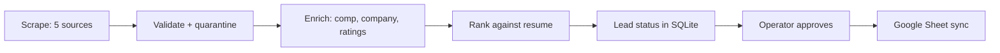

# AgentZero

AgentZero is a **local, résumé-driven job search agent**. Drop your résumé in `resume/`, run a
daily pipeline, and it will:

- Scrape **five job boards** (Indeed, LinkedIn, Glassdoor, Google Jobs, ZipRecruiter)
- **Enrich** listings (comp, company size, Glassdoor, careers URLs)
- **Rank** jobs against your résumé with an LLM
- Mirror everything to **SQLite** and an optional **Google Sheet** tracker
- Track applications you mark in the sheet — it never auto-submits

Built as a working tool and an open-book example of agentic co-programming in Cursor (Ralph
loop, TDD gates, human-in-the-loop where it matters).

---

## Architecture at a glance



---

## Design tradeoffs

- **Local-first trust boundary**: data and credentials stay on your machine; MCP is stdio-only
- **Lead-gated workflow**: new jobs land as `lead` in SQLite first; only approved rows reach the sheet
- **Full-sheet sync model**: sheet sync rewrites the worksheet from SQLite to keep one source of truth
- **Scrape reliability over elegance**: browser/CDP paths are explicit and operationally opinionated
- **Security pragmatism**: SSRF defenses are strongest on enrichment HTTP; board scraping intentionally navigates board URLs

---

## Quality bar

- **CI enforced**: `ruff`, full `pytest -q`, UTF-8/UTF-16 encoding guard (`.github/workflows/ci.yml`)
- **TDD + regression coverage** on parser drift, lead/export policy, and session safety paths
- **Idempotent pipeline design** via stable `job_id` and per-stage status gates
- **Explicit operator safety**: no auto-apply, no silent scrape/commit in MCP interactive flow

---

## Quick start

**New users:** follow **[docs/GETTING_STARTED.md](docs/GETTING_STARTED.md)** (install, Chrome
for CAPTCHA, daily loop).

```powershell
python -m venv .venv
. .venv\Scripts\Activate.ps1
pip install -e ".[dev,scrape,llm,google,mcp]"
playwright install chrome
copy .env.example .env                # set OPENAI_API_KEY + SCRAPE_BROWSER_CHANNEL=chrome
python scripts/google_auth.py         # Sheets-only OAuth → token.json (optional)
python scripts/login_job_boards.py --site linkedin,glassdoor
python scripts/smoke_test.py
pytest -q
```

Dependencies are grouped in `pyproject.toml`: `dev`, `scrape`, `llm`, `google`, `mcp`.

---

## How to use it

### 1. Prepare

1. Put your résumé in `resume/` (gitignored).
2. Copy `.env.example` → `.env` and set `OPENAI_API_KEY` (or `ANTHROPIC_API_KEY`).
3. Set **`AGENTZERO_SCRAPE_BROWSER_CHANNEL=chrome`** — use full Chrome, not bundled Chromium, for CAPTCHA.
4. Optionally set `AGENTZERO_SHEET_ID` and run `python scripts/google_auth.py`.
5. On Windows, dot-source `scripts/dev-env.ps1` to avoid UTF-16 file corruption.

### 2. Daily pipeline

**Recommended — interactive lead session** (scrape → review → approve → sheet):

```powershell
python scripts/run_lead_session.py              # prompts for titles/locations/comp
python scripts/run_lead_session.py --all-titles # query every title, not just the first
```

Or the classic non-gated pipeline:

```powershell
python scripts/run_scrape.py          # scrape → validate → shallow enrich → SQLite
python scripts/enrich_jobs.py         # deep enrich: detail pages, Glassdoor, web search
python scripts/rank_and_sync.py --yes       # rank + sync (sync requires --yes)
python scripts/sync_sheets.py --dry-run
python scripts/sync_sheets.py --yes   # import sheet edits, then push to Google Sheet
```

| Stage | What it does |
|-------|----------------|
| **Scrape** | Five boards, sequential; prompts for titles, locations, comp floor |
| **Lead review** | New roles land as `lead` in SQLite; approve before they hit the sheet |
| **Shallow enrich** | Parse comp/size/Glassdoor from fields on the job; filter by comp floor |
| **Deep enrich** | Fetch posting URLs, Glassdoor lookup, DuckDuckGo company research |
| **Rank** | LLM fit score + rationale vs your résumé |
| **Sync** | Import `date_applied`/status from sheet → SQLite, then push rows (≥0.75 match score by default; applied jobs always kept) |

Restore application history from the sheet after a DB purge:

```powershell
python scripts/import_sheet_status.py --dry-run
python scripts/import_sheet_status.py --sync
```

**Backfill** (repair existing DB rows without a full re-scrape):

```powershell
python scripts/backfill_linkedin_comp.py
python scripts/backfill_glassdoor_companies.py
```

To drop DB rows you removed from the sheet:

```powershell
python scripts/prune_db_from_sheet.py --dry-run
python scripts/prune_db_from_sheet.py --yes
```

### 3. Search targeting

On every scrape, AgentZero reads your latest résumé, uses the LLM to infer search terms and
locations, then **prompts you** to confirm:

- Job titles (most recent role first)
- **Remote-only** by default (`AGENTZERO_REMOTE_ONLY=true`) — United States remote filter; on-site/hybrid listings are dropped (applied jobs are protected)
- Work mode (remote USA vs in-office cities) only when `REMOTE_ONLY=false`
- **Minimum acceptable salary** — listings are kept when the **top of the posted range** meets or
  exceeds this floor (e.g. $230k)

### 4. Quality filters

AgentZero layers filters so the sheet stays actionable:

| Stage | What | Config |
|-------|------|--------|
| **Scrape** | Title must match search terms; hard-reject marketing/HR/etc. | `AGENTZERO_SEARCH_TERMS` |
| **Remote** | Drop on-site/hybrid unless you've applied | `AGENTZERO_REMOTE_ONLY=true` |
| **Rank** | LLM scores each job 0.0–1.0 vs your résumé | `rank_and_sync.py` |
| **Export** | Sheet/CSV omit jobs below match floor; applied jobs always export | `AGENTZERO_MIN_MATCH_SCORE=0.75` (set `0` to disable) |

Jobs filtered from the sheet **remain in SQLite** — re-sync or lower the floor to surface them.

### 6. Application tracking

Edit these columns in the Google Sheet (imported into SQLite before every sync):

- `date_applied` — marks a role as applied; auto-sets status to `applied` when blank; protects from purges
- `status` — `lead`, `new`, `applied`, `rejected`, `offer`, etc.
- `notes`

The Google Sheet shows 13 operator columns; run `export_csv` for the full 24-column dump from SQLite.

### 7. MCP agent (Cursor)

Enable the project MCP server (`.cursor/mcp.json` is included) or register manually.
Requires `pip install -e ".[mcp]"` so `fastmcp` is in `.venv`.

**Windows** (`.cursor/mcp.json` default):

```json
{
  "command": "${workspaceFolder}/.venv/Scripts/python.exe",
  "args": ["-m", "agentzero.mcp_server", "--stdio"],
  "cwd": "${workspaceFolder}"
}
```

**macOS/Linux:** change `Scripts/python.exe` → `bin/python`.

The MCP server includes **interactive workflow instructions** — the agent should run the
lead session **in chat**, confirming with you before each scrape and sheet commit:

1. `lead_session_workflow` / `suggest_targets` — propose titles/locations/comp
2. `check_sessions` — verify logins (CDP Chrome **auto-starts** when not running)
3. `run_scrape` — after you confirm parameters
4. Present scored roles; `commit_leads` only for job_ids you select

Same core as `scripts/run_lead_session.py`. See also `AGENTS.md`.

### 8. Scraping notes

Snapshot saved to `resume/search_profile.json` (gitignored). Skip the prompt only for CI:
`run_scrape.py --no-search-prompt`.

Defaults: **Indeed, LinkedIn, Glassdoor** via Playwright + **Chrome**; **Google Jobs, ZipRecruiter** via JobSpy HTTP.

```powershell
python scripts/verify_browser_session.py --site linkedin   # before first scrape
python scripts/run_scrape.py --limit 5
```

- Visible **Chrome** window (`AGENTZERO_SCRAPE_BROWSER_CHANNEL=chrome`) — complete CAPTCHA once per board.
- ZipRecruiter may 403 without proxies (`AGENTZERO_PROXIES=host:port`).

Full operator guide: **[docs/SCRAPING.md](docs/SCRAPING.md)**.

---

## Documentation

### Use AgentZero (install and daily loop)

| Doc | Contents |
|-----|----------|
| **[Getting started](docs/GETTING_STARTED.md)** | Install, Chrome/CAPTCHA setup, daily pipeline, troubleshooting |
| [Scraping & OAuth](docs/SCRAPING.md) | Boards, scripts, rate limits, browser sessions, filters, tracker sync |
| [Security](docs/SECURITY.md) | Secrets, OAuth scopes, SSRF, LLM data |
| [Cost & models](docs/COST_AND_MODELS.md) | LLM pricing, model selection, knobs |

### Build and architecture (contributors / curious readers)

| Doc | Contents |
|-----|----------|
| [How AgentZero Was Built](docs/BUILD_STORY.md) | Cursor / Ralph loop / TDD story |
| [Original build plan](docs/agentzero_job_hunter_d85b7004.plan.md) | Architecture, 22-task DAG |
| [examples/job_sources.json](docs/examples/job_sources.json) | Reference list of core sources (not loaded at runtime) |
| [PROGRESS.md](PROGRESS.md) | MVP + post-MVP checkbox ledger |
| [WORKLOG.md](WORKLOG.md) | Append-only build history |
| [Public release checklist](docs/PUBLIC_RELEASE_CHECKLIST.md) | What to include/exclude before publishing |

---

## Cost

**Pricing estimates as of 2026-05-29.** A full scrape-and-rank run usually costs **~$0.01–0.10**
depending on model and how many unique jobs are ranked.

| Model (OpenAI) | ~100 jobs ranked |
|----------------|------------------|
| **gpt-5-nano** (default) | **~$0.02** |
| gpt-4o-mini | ~$0.06 |

```powershell
python scripts/estimate_cost.py   # estimate from your .env
```

See **[Cost and model selection](docs/COST_AND_MODELS.md)** for criteria, truncation knobs, and
monthly ballparks.

---

## Disclaimer

Scraping job boards may violate site Terms of Service. Use at your own risk; respect rate limits.
AgentZero queues applications for human review and does not auto-submit.

**Privacy:** Résumé and job text are sent to your configured LLM provider when ingest/rank
features run. See **[docs/SECURITY.md](docs/SECURITY.md)** for secrets, OAuth scopes, and network
egress.

**Windows:** If markdown or TOML won't render, run `python tools/fix_encoding.py` before committing.
