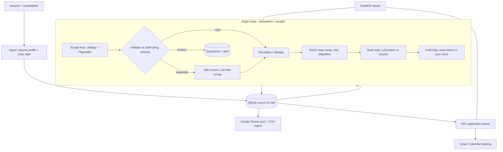
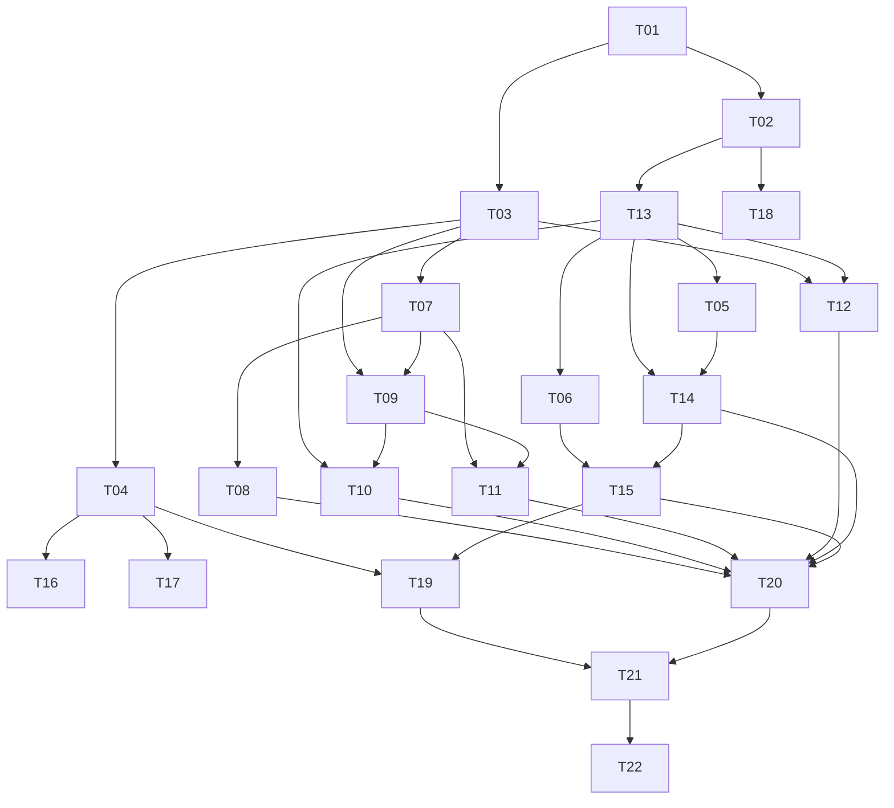

> **Archived build plan** — originally authored in Cursor Plan mode, May 2026.
> This file is the durable spec the Ralph build loop re-read each iteration.
> For a narrative overview of the co-programming process, see [BUILD_STORY.md](BUILD_STORY.md).
> Live completion state: [PROGRESS.md](../PROGRESS.md). Append-only history: [WORKLOG.md](../WORKLOG.md).

## Mission, confirmed

Build `AgentZero`: drop a resume in `resume/` and writing samples in `coverletters/`, and the agent sources jobs across many boards, enriches them (comp, company size, Glassdoor rating, posting age), ranks them against your resume, drafts cover letters in your voice, queues applications for your one-click submit, and tracks everything in a sortable/filterable spreadsheet (local CSV/SQLite + live Google Sheet). Published as a public Git repo to help others.

Locked decisions (from your answers):
- Sourcing: scrape-heavy (Playwright + JobSpy), including Glassdoor; accept ToS/fragility risk.
- Applications: human-in-the-loop (agent drafts + pre-fills + queues; you review & submit).
- LLM: provider-agnostic (OpenAI + Anthropic, selected via env).
- Spreadsheet: local source-of-truth (SQLite + CSV) synced/exported to Google Sheets.

## Tech stack (verified current)
- `python-jobspy` v1.1.82 (MIT) - one call scrapes Indeed, LinkedIn, Glassdoor, Google, ZipRecruiter, Bayt into a DataFrame, and already returns `company_rating`/`company_reviews_count` for several sources. This is our scraping backbone.
- `playwright` - custom scrapers for boards JobSpy misses (Greenhouse/Lever/Ashby company boards) and a Glassdoor company-rating enrichment fallback.
- `fastmcp` v3.x - exposes every capability as MCP tools so the Cursor agent (and others) can drive the system.
- `langgraph` - orchestrates the sourcing -> enrich -> rank -> draft pipeline as a resumable state graph.
- `pydantic` v2 + `pydantic-settings` - typed models + config/secrets.
- `sqlmodel`/`sqlalchemy` + SQLite - durable source-of-truth and idempotency state.
- `gspread` + `google-api-python-client`/`google-auth` - Sheets + Gmail/Calendar/Drive.
- `pytest` + `respx`/`vcrpy` + `pytest-asyncio` - TDD with recorded HTTP so scrapers/LLM are testable offline.

## Architecture

Idempotency / Ralph loops: each loop is a pure `read state -> compute pending work -> process batch -> write state` cycle keyed on a stable `job_id` hash (source+company+title+location/url). Re-running never double-processes (status columns gate work) and never double-applies. Parallelism is per-source `asyncio`/thread pools with rate-limits + optional proxy rotation; LinkedIn is throttled hardest (rate-limits ~page 10/IP, so proxies are configurable).

## Proposed repo layout
- `agentzero/config.py` - pydantic-settings (LLM keys, proxies, Google creds, search params).
- `agentzero/models.py` - `JobPosting`, `CompanyInfo`, `ResumeProfile`, `VoiceProfile`, `Application`.
- `agentzero/ingest/` - `resume.py` (PDF/docx -> structured profile via LLM), `voice.py` (writing samples -> style guide).
- `agentzero/scrape/` - `base.py` (source interface returning raw dicts), `jobspy_source.py`, `glassdoor.py` (Playwright ratings), `ats/` (Greenhouse/Lever/Ashby).
- `agentzero/scrape/validate.py` - schema validation + self-correction gate between every source and storage (see "Cross-board resilience" below).
- `agentzero/enrich/` - `comp.py`, `company.py` (size), `glassdoor_rating.py`.
- `agentzero/rank/matcher.py` - LLM job-vs-resume scoring + rationale.
- `agentzero/generate/cover_letter.py` - voice-matched drafts -> `output/cover_letters/`.
- `agentzero/apply/` - `queue.py` (HITL), `ats/` pre-fillers, status + dates.
- `agentzero/google/` - `auth.py`, `gmail.py`, `calendar.py`, `drive.py`, `sheets.py`.
- `agentzero/llm/provider.py` - pluggable OpenAI/Anthropic behind one interface.
- `agentzero/loops/ralph.py` + `pipeline.py` - loop runner + LangGraph graph.
- `agentzero/mcp_server.py` - FastMCP tools.
- `resume/`, `coverletters/`, `output/cover_letters/`, `data/agentzero.db`, `tests/`, `pyproject.toml`, `.env.example`, `README.md`.
- `PROGRESS.md` (mutable checkbox ledger / loop memory) + `WORKLOG.md` (append-only, write-only running work log).

## Cross-board resilience: validation + self-correction
Every scraper implements a single `JobSource.fetch() -> list[RawRecord]` interface and returns raw dicts; nothing reaches storage without passing through `agentzero/scrape/validate.py`. The gate runs three stages per record:

1. Validate: coerce the raw dict into the `JobPosting` pydantic model. Required fields (`title`, `company`, `url`, `source`) must be present and well-typed; the rest are optional/nullable so a board missing comp or rating still yields a usable row.
2. Self-correct (only on failure): a deterministic mapper first (per-source field-alias table + common transforms - e.g. `job_title`->`title`, salary string -> `comp_min/comp_max/currency`, relative dates -> `date_posted`). If validation still fails, an LLM repair pass receives the raw record + the `JobPosting` JSON schema + the pydantic error and returns a corrected object, which is re-validated. This is what lets a board survive a layout/field change without code edits.
3. Quarantine + alert: records that still fail are written to a `quarantine` table (raw payload + error) instead of being silently dropped, and the source is flagged unhealthy.

Health + drift detection (the "ensure this works across several job boards" part):
- Per-source metrics recorded each run: rows returned, valid %, repaired %, quarantined %, required-field null rates. A source whose valid% drops below a threshold (e.g. < 80%) raises a loud failure rather than quietly returning garbage.
- Contract tests: each source has a committed sample/fixture (recorded via `vcrpy`); a `pytest` contract test asserts the source still maps onto `JobPosting` and that schema-drift is caught in CI, not in production.
- The repair field-alias tables are data, not code, so adapting to a board change is usually a config tweak; the LLM pass is the fallback.

## Spreadsheet schema (sortable/filterable)
`source` (where found) | `company` | `role/title` | `comp_min` | `comp_max` | `currency` | `company_size` | `glassdoor_rating` | `glassdoor_reviews` | `date_posted` | `posting_age_days` | `location` | `remote` | `url` | `match_score` | `status` | `date_first_contacted` | `date_applied` | `notes`. Stored in SQLite, exported to CSV, mirrored to a live Google Sheet with filter views.

## Building this IN a Ralph loop

Yes - this plan is structured so a loop can build it without ever holding the whole repo in context. Two distinct "Ralph loops" exist and should not be confused:
- Build loop (dev time): an agent loop that implements one task per iteration until the MVP is done. Described here.
- Runtime loops (the product): the idempotent scrape/enrich/rank/draft loops the finished app runs. Described in "Architecture" above.

### Build-loop contract (the constant prompt run each iteration)
The loop re-reads only two files each tick - this plan and `PROGRESS.md` (the durable checkbox ledger) - never the whole codebase. Each iteration:
1. Read this plan's "Task ledger" + `PROGRESS.md`. (Do NOT read the full `WORKLOG.md` back in - it is write-only history, not context.)
2. Pick the first unchecked task whose deps are all checked.
3. Open ONLY the files that task names (each task is scoped to <= ~3 files + its test). This is what keeps context small.
4. Append a WORKLOG "START" line for the task (see below), then write the failing test(s) straight from the task's Acceptance line, then implement until green.
5. Run the task's exact Acceptance command. If green: check the box in `PROGRESS.md`, append a WORKLOG "DONE" entry, commit with the task id, and end the iteration. If red after a bounded number of tries: append a WORKLOG "BLOCKED" entry, note the blocker in `PROGRESS.md` under that task, and stop for human input.
6. Stop. The loop wakes and starts the next iteration fresh.

### Work log (`WORKLOG.md`) - detailed, running, write-only
A single append-only ledger of everything the build does. Rules: only ever append; never edit, reorder, or delete prior lines (it is the immutable audit trail, distinct from `PROGRESS.md` which holds current checkbox state). The loop appends but never loads it back into context, so it can grow without bloating iterations. Each entry is one timestamped block:
- `[ISO-8601 timestamp] Txx STATE` where STATE is START / DONE / BLOCKED.
- What was attempted/changed (1-3 lines), files touched, the exact Acceptance command run and its result, the commit hash on DONE, and any decision or blocker on BLOCKED.

Append-only is enforced in practice by only ever writing with append semantics and by a committed CI check that fails if existing `WORKLOG.md` lines are modified or removed (only net-new trailing lines allowed).

### Parallel execution (multitasking the build loop)
The tasks form a dependency DAG, not a straight line, so the loop can build several independent tasks at once. Instead of "pick the first unchecked task," the parallel loop computes the ready-set (every unchecked task whose deps are all checked) and dispatches up to N of them concurrently.

Resulting parallel waves (each wave's tasks run concurrently; ~9 waves vs 22 serial iterations):
- Wave 1: T01
- Wave 2: T02, T03
- Wave 3: T04, T07, T13
- Wave 4: T05, T06, T08, T09, T12, T16, T17, T18
- Wave 5: T10, T11, T14
- Wave 6: T15
- Wave 7: T19, T20
- Wave 8: T21
- Wave 9: T22

Execution mechanism: a coordinator (parent) computes the ready-set, then launches each ready task as a worker in its own isolated git worktree + branch (one task per worktree). Because every task is scoped to its own ~3 files, parallel branches rarely touch the same file, so merges are clean. Each worker writes its failing test, implements, and runs its own Accept command in isolation.

Conflict + correctness rules (what makes parallelism safe):
- Foundation is serialized: shared-by-many files (`models.py` in T03, `base.py`/`RawRecord` in T07, `config.py` in T02, `provider.py` in T13) are completed in early waves and treated as frozen during later parallel waves. A parallel task needing a new model field is a signal to serialize a small model change first, not to edit `models.py` in two branches at once.
- Coordinator owns the shared ledgers: only the coordinator checks boxes in `PROGRESS.md` and appends to `WORKLOG.md`, and it does so serially as each worker branch goes green and merges. Workers never write the shared ledgers directly - this keeps `WORKLOG.md` strictly append-only and conflict-free. Each merge is gated on that branch's Accept command passing on the merged tree.
- Bounded concurrency: N workers cap (and per-source limits at runtime) so we don't exhaust API/rate limits; a worker that BLOCKs doesn't stall its siblings - the wave completes the rest and the coordinator pauses only the dependents of the blocked task.

### Parallelism in the runtime loops (the product)
The runtime scrape/enrich/rank/draft loops are embarrassingly parallel per `job_id`: validate, enrich, rank, and draft each fan out over pending rows with a bounded worker pool, while scraping fans out per source. Per-source rate limits + optional proxy rotation cap concurrency (LinkedIn throttled hardest). Idempotency by `job_id` means parallel workers never collide or double-process, and a crashed worker's rows simply remain "pending" for the next tick.

Why it's safe to loop (idempotency): the Acceptance command is the single source of truth for "done". Re-running a checked task is a no-op (its tests already pass); re-running an interrupted task is safe because tests gate completion and files are overwritten deterministically. No task depends on in-memory state from a previous iteration.

Global definition of done (loop stop condition): every box in `PROGRESS.md` checked AND `pytest -q` fully green AND total coverage >= 85% (branch coverage on) via `--cov-fail-under=85` AND the critical modules at 100% (see below) AND `ruff check .` clean AND `python -m agentzero.mcp_server --help` runs.

### Test coverage standard (TDD)
Coverage is a guardrail, not the goal - the goal is that every behavior named in a task's Accept line was driven by a test. Tiered targets:
- 100% (line + branch), enforced per-task: `agentzero/models.py` (T03), `agentzero/storage/db.py` (T04), `agentzero/scrape/validate.py` (T09/T10), `agentzero/enrich/comp.py` (T12). These carry the "works across many boards" + "safe to re-run in parallel" promises, so they must be fully covered incl. edge cases (missing comp, malformed dates, alias remaps, duplicate `job_id`).
- 70-85% - orchestration + I/O wrappers (loops/pipeline T20, CSV/Sheets, apply queue): cover branching + idempotency, not every glue line.
- Behavior-only - external-surface adapters (scrapers T08/T11, Google T18, LLM provider T13): cover mapping/parsing against recorded fixtures + contract tests; live network paths are not line-covered by design.
- Repo-wide floor: 85% with branch coverage on. Pytest is configured (T01) with `--cov=agentzero --cov-branch --cov-fail-under=85`; per-task 100% targets are asserted with `--cov=<module> --cov-fail-under=100` in that task's Accept.
- Mutation spot-checks: `mutmut` run occasionally against `validate.py` + `comp.py` to confirm tests assert behavior rather than just execute lines (not a per-iteration gate).

`PROGRESS.md` seed: one `- [ ] Txx <title>` line per task below, in order, committed in the scaffold task so the loop has memory from iteration one. `WORKLOG.md` is created empty (header only) in the same scaffold task.

### Task ledger (each task = one loop iteration: scoped files + a runnable Acceptance gate)
Format per task: id - title; Files; Accept (command -> expected). Dependencies are defined by the DAG in "Parallel execution" above (not by list order), so the coordinator can run independent tasks concurrently.

- T01 - Scaffold. Files: `pyproject.toml`, `agentzero/__init__.py`, `.gitignore`, `.env.example`, `PROGRESS.md`, `WORKLOG.md`, `tests/conftest.py`, `tests/test_worklog_append_only.py`. Accept: `pip install -e .[dev] && pytest -q && ruff check .` -> install ok, 0 failures, lint clean; pytest configured with `--cov=agentzero --cov-branch --cov-fail-under=85` (pytest-cov + mutmut in dev deps); `python -c "import agentzero"` exits 0; `PROGRESS.md` seeded with T01-T22 checkboxes; `WORKLOG.md` exists; append-only test passes.
- T02 - Config. Files: `agentzero/config.py`, `tests/test_config.py`. Accept: `pytest tests/test_config.py` -> settings load LLM provider/keys/proxies/search params from env + `.env`, missing-required raises clear error.
- T03 - Core models. Files: `agentzero/models.py`, `tests/test_models.py`. Accept: `pytest tests/test_models.py --cov=agentzero.models --cov-branch --cov-fail-under=100` -> `JobPosting` enforces required `title/company/url/source`, optional comp/rating/size nullable; `stable_job_id()` is deterministic for same source+company+title+url; 100% coverage.
- T04 - Storage. Files: `agentzero/storage/db.py`, `tests/test_db.py`. Accept: `pytest tests/test_db.py --cov=agentzero.storage.db --cov-branch --cov-fail-under=100` -> upsert by `job_id` is idempotent (2x upsert = 1 row), `quarantine` table stores raw payload + error, status columns gate work queries; 100% coverage.
- T05 - Resume ingest. Files: `agentzero/ingest/resume.py`, `tests/test_resume.py`, fixture in `tests/fixtures/`. Accept: `pytest tests/test_resume.py` -> sample PDF/docx -> `ResumeProfile` with name/skills/experience (LLM mocked).
- T06 - Voice ingest. Files: `agentzero/ingest/voice.py`, `tests/test_voice.py`. Accept: `pytest tests/test_voice.py` -> sample writing -> `VoiceProfile` style fields (LLM mocked).
- T07 - Source interface. Files: `agentzero/scrape/base.py`, `tests/scrape/test_base.py`. Accept: `pytest tests/scrape/test_base.py` -> `JobSource.fetch() -> list[RawRecord]` contract holds for a fake source.
- T08 - JobSpy source. Files: `agentzero/scrape/jobspy_source.py`, `tests/scrape/test_jobspy.py`, recorded fixture. Accept: `pytest tests/scrape/test_jobspy.py` -> maps JobSpy rows to `RawRecord` offline (network mocked via vcr/monkeypatch).
- T09 - Validation gate (deterministic). Files: `agentzero/scrape/validate.py`, `tests/scrape/test_validate.py`. Accept: `pytest tests/scrape/test_validate.py --cov=agentzero.scrape.validate --cov-branch --cov-fail-under=100` -> valid passes; aliased record (`job_title`->`title`, salary str -> comp) repaired by alias table; unfixable -> quarantine row; 100% coverage (T10 keeps it at 100%).
- T10 - Validation self-correct (LLM) + health. Files: `agentzero/scrape/validate.py` (extend), `tests/scrape/test_validate_llm.py`. Accept: `pytest tests/scrape/test_validate.py tests/scrape/test_validate_llm.py --cov=agentzero.scrape.validate --cov-branch --cov-fail-under=100` -> broken record + mocked LLM repair re-validates to `JobPosting`; per-source metrics (valid%/repaired%/quarantined%) computed; valid% < threshold raises; validate.py stays at 100%.
- T11 - Playwright/ATS + Glassdoor source. Files: `agentzero/scrape/ats/`, `agentzero/scrape/glassdoor.py`, `tests/scrape/test_ats.py`. Accept: `pytest tests/scrape/test_ats.py` -> parses saved HTML fixtures into `RawRecord` incl. Glassdoor rating; contract test catches schema drift.
- T12 - Enrichment. Files: `agentzero/enrich/comp.py`, `company.py`, `glassdoor_rating.py`, `tests/test_enrich.py`. Accept: `pytest tests/test_enrich.py` -> comp parsed/estimated (estimate flagged), size + rating populated, missing data tolerated; `comp.py` at 100% via `--cov=agentzero.enrich.comp --cov-branch --cov-fail-under=100`.
- T13 - LLM provider. Files: `agentzero/llm/provider.py`, `tests/test_llm.py`. Accept: `pytest tests/test_llm.py` -> one interface dispatches to OpenAI/Anthropic by env (both mocked).
- T14 - Ranking. Files: `agentzero/rank/matcher.py`, `tests/test_matcher.py`. Accept: `pytest tests/test_matcher.py` -> `JobPosting` + `ResumeProfile` -> `match_score` + rationale (LLM mocked), deterministic ordering.
- T15 - Cover letters. Files: `agentzero/generate/cover_letter.py`, `tests/test_cover.py`. Accept: `pytest tests/test_cover.py` -> draft written to `output/cover_letters/`, uses `VoiceProfile`, idempotent filename per job.
- T16 - CSV export. Files: `agentzero/storage/csv_export.py`, `tests/test_csv.py`. Accept: `pytest tests/test_csv.py` -> exports exact spreadsheet schema columns from DB; stable row order.
- T17 - Sheets sync. Files: `agentzero/google/sheets.py`, `tests/test_sheets.py`. Accept: `pytest tests/test_sheets.py` -> upserts rows to a Sheet by `job_id` (gspread mocked), idempotent.
- T18 - Google auth + Gmail/Calendar/Drive. Files: `agentzero/google/auth.py`, `gmail.py`, `calendar.py`, `drive.py`, `tests/test_google.py`. Accept: `pytest tests/test_google.py` -> token load/refresh + send/create/list wrappers (Google clients mocked).
- T19 - HITL apply queue. Files: `agentzero/apply/queue.py`, `agentzero/apply/ats/`, `tests/test_apply.py`. Accept: `pytest tests/test_apply.py` -> queue lists pending, records `date_first_contacted`/`date_applied`, pre-fill payload built, never auto-submits, no double-apply.
- T20 - Runtime Ralph loop + pipeline. Files: `agentzero/loops/ralph.py`, `agentzero/loops/pipeline.py`, `tests/test_loops.py`. Accept: `pytest tests/test_loops.py` -> LangGraph pipeline runs scrape->validate->enrich->rank->draft; re-run is a no-op on already-processed `job_id`s; parallel batch respects per-source limits.
- T21 - FastMCP server. Files: `agentzero/mcp_server.py`, `tests/test_mcp.py`. Accept: `pytest tests/test_mcp.py` -> tools (scrape/enrich/rank/generate/queue) registered with pydantic schemas; `python -m agentzero.mcp_server --help` runs.
- T22 - Publish polish. Files: `README.md`, `LICENSE`, `resume/.gitkeep`, `coverletters/.gitkeep`, sample fixtures. Accept: `pytest -q && ruff check .` fully green; README documents setup + ToS disclaimer; repo ready to push public.

## Post-build enhancements (after T22)

These followed the same TDD + commit pattern but were not in the original ledger:

- **`agentzero/ingest/search_profile.py`** — LLM extracts search terms from the résumé on every scrape run; recent job titles prioritized first; snapshot saved to `resume/search_profile.json` (git-ignored, for inspection only).
- **`JobSpySource.fetch()`** — re-derives search terms from the latest résumé each run via `get_effective_settings()`, not stale env-only terms.
- **Windows UTF-8 tooling** — `tools/fix_encoding.py`, `.gitattributes`, `scripts/dev-env.ps1` so Cursor/file writes don't corrupt encoding on Windows.

## Risks / things to flag
- Legal/ToS: scraping LinkedIn/Glassdoor/Indeed violates their ToS and may break anytime; LinkedIn/Glassdoor need proxies for volume and may hit CAPTCHAs. README will include a clear disclaimer + a "respect rate limits / use at your own risk" notice.
- Glassdoor ratings: best via JobSpy's `company_rating` field; Playwright fallback is brittle and bot-protected.
- Google APIs: Gmail/Drive send/modify scopes require an OAuth consent screen; for personal use we'll use a Desktop OAuth client + local token (documented setup), no Google verification needed for your own account.
- Comp data is often missing; we parse from descriptions and mark estimates explicitly.
- Secrets: `.env` + Google token files git-ignored; only `.env.example` committed.

## Open items to confirm during build (non-blocking)
- Target roles/titles, locations, remote-only?, and salary floor for the initial search profile.
- Whether to add proxy credentials now or stub them.
