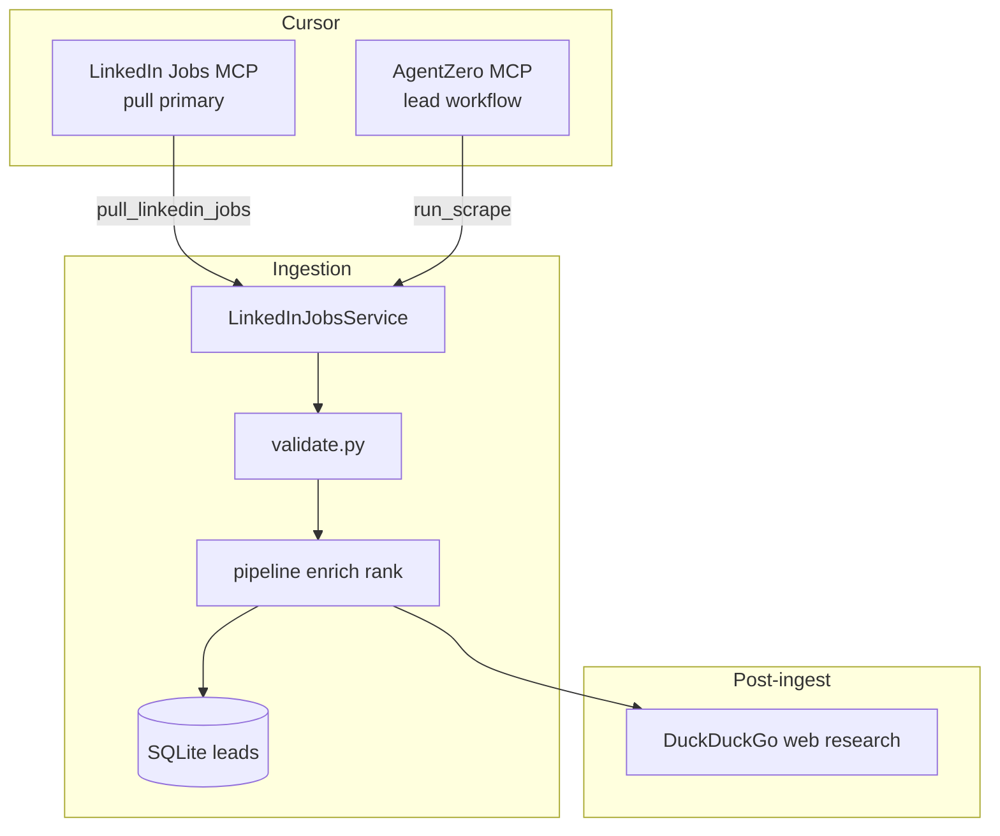
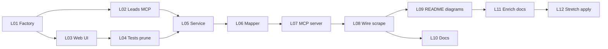

# LinkedIn-first ingestion and jobs MCP

## Mission

Refocus AgentZero on **LinkedIn as the sole job-board source** for this epic. Quality listings have come from LinkedIn; Indeed and Glassdoor board scraping are **removed from production** (not merely disabled). Ingestion becomes **more reliable** through a shared `LinkedInJobsService`, with the **primary operator surface** being a **LinkedIn jobs MCP** optimized for **pulling** listings (search + detail → validate → SQLite leads).

**Done when:** `run_scrape` / lead session ingest only LinkedIn; Cursor can drive **`pull_linkedin_jobs`** (and related tools) on the jobs MCP; README and AGENTS describe a LinkedIn-first pipeline with updated mermaid diagrams; tests and factory no longer assume three-board scrape.

**Stretch (L12):** HITL **apply** helpers on MCP (open apply URL, record `date_applied`) — never auto-submit; builds on existing [`agentzero/apply/tracking.py`](agentzero/apply/tracking.py) and `JobPosting.date_applied`.

## Locked decisions

| Decision | Choice |
|----------|--------|
| Job boards | **LinkedIn only** for scrape/ingest in this epic — **remove** Indeed and Glassdoor from [`factory.py`](agentzero/scrape/factory.py), default `scrape_browser_sites`, lead `check_sessions`, and operator docs |
| Indeed/Glassdoor code | **Delete or archive** board-specific scrape modules once unused (`browser_indeed.py`, `browser_glassdoor.py`, related scripts/tests) — phased in L01–L04, not one giant commit |
| CDP | **Not required** for LinkedIn; with boards removed, **CDP defaults empty** and CDP auto-launch/docs de-emphasized (host Chrome for Indeed/Glassdoor no longer documented as primary path) |
| Primary MCP | **LinkedIn jobs MCP** = pull surface (`pull_linkedin_jobs`, `get_job_details`, session tools) |
| AgentZero MCP | Keeps **lead workflow** (`suggest_targets`, confirm, `run_scrape`, `commit_leads`) — `run_scrape` delegates to same `LinkedInJobsService` as jobs MCP |
| Enrichment | **DuckDuckGo unchanged** for company size, careers URL, etc. DDG may still surface Glassdoor *snippets* in research — that is not board scraping |
| Browser | Playwright profile `data/browser_profiles/linkedin`; shared with `login_job_boards.py --site linkedin` |
| Apply | **Stretch only** — HITL; reuse `date_applied` / `ApplicationStatus`; no LinkedIn auto-apply |
| Fork stickerdaniel | **No** — tool naming/serialization patterns only |
| Out of scope | Re-adding Indeed/Glassdoor; external PyPI linkedin-mcp; profiles/inbox MCP; rate-limit product |

## Architecture (target)



**Reliability themes** (L05, L08): single code path for MCP pull and `run_scrape`; session preflight; consistent CAPTCHA/login messaging; fixture-backed parser tests; serialized browser lock on MCP (L07).

## CDP

With Indeed/Glassdoor removed, **CDP is not part of the operator happy path**. LinkedIn uses Playwright persistent context. Legacy `scrape_cdp_*` settings may remain in config for power users but defaults and docs no longer center on CDP.

## Build-loop contract

- Plan file: commit as [`docs/linkedin-first-ingest.plan.md`](docs/linkedin-first-ingest.plan.md) at execution start (copy from this plan)
- Ledger: [`PROGRESS.md`](PROGRESS.md) — `L01`…`L12` (L12 = stretch)
- Append-only [`WORKLOG.md`](WORKLOG.md)
- Branch prefix: `feat/linkedin-first-L0x-short-title`
- **prep-pr** + CodeQL after each task Accept

## Git + PR workflow

One branch per ledger task; no implementation on `main`. Large refactor = **more small PRs**, not one branch. L12 stretch is optional separate PR after L01–L11 merge.

## Test / quality standard

```powershell
pip install -e ".[dev,scrape,llm,mcp,web]"
ruff check agentzero tests scripts tools
pytest -q
python tools/codeql_check.py
```

No live HTTP in unit tests ([`tests/conftest.py`](tests/conftest.py)).

## Security gate

CodeQL before push. MCP stdio-only. Apply stretch must preserve **no auto-apply** ([`docs/SECURITY.md`](docs/SECURITY.md)).

## Parallel execution



| Wave | Tasks |
|------|--------|
| 1 | L01 |
| 2 | L02, L03 (parallel after L01) |
| 3 | L04 |
| 4 | L05 |
| 5 | L06 → L07 |
| 6 | L08 |
| 7 | L09, L10 (parallel after L08) |
| 8 | L11 |
| 9 (stretch) | L12 |

## Task ledger

### Phase 1 — Remove Indeed / Glassdoor from production scrape

- **L01 — Factory and config LinkedIn-only.** Branch: `feat/linkedin-first-L01-factory`.  
  Files: [`agentzero/scrape/factory.py`](agentzero/scrape/factory.py), [`agentzero/config.py`](agentzero/config.py), [`agentzero/scrape/resilience.py`](agentzero/scrape/resilience.py), [`tests/scrape/test_factory.py`](tests/scrape/test_factory.py), [`tests/test_config.py`](tests/test_config.py).  
  Test-first: `test_build_scrape_source_linkedin_only`, `test_default_browser_sites_linkedin`, `test_factory_rejects_empty_sites`.  
  Accept: `pytest tests/scrape/test_factory.py tests/test_config.py -q` → 0 failures.  
  Ship: prep-pr.

  `CORE_BROWSER_SITES = ("linkedin",)`. Defaults: `scrape_browser_sites=["linkedin"]`, `scrape_cdp_sites=[]` (or omit CDP sites). `build_scrape_source` raises clear error if LinkedIn disabled.

- **L02 — Lead session and AgentZero MCP LinkedIn-only.** Branch: `feat/linkedin-first-L02-leads`.  
  Files: [`agentzero/leads/session.py`](agentzero/leads/session.py), [`agentzero/mcp_server.py`](agentzero/mcp_server.py), [`agentzero/mcp/workflow.py`](agentzero/mcp/workflow.py), [`tests/test_leads_session.py`](tests/test_leads_session.py), [`tests/test_mcp.py`](tests/test_mcp.py).  
  Test-first: `test_check_sessions_only_probes_linkedin`, workflow text mentions LinkedIn not three boards.  
  Accept: `pytest tests/test_leads_session.py tests/test_mcp.py tests/test_mcp_workflow.py -q` → 0 failures.  
  Ship: prep-pr.

  `check_sessions` / `ensure_cdp_for_sites` no longer target Indeed/Glassdoor. Update `MCP_SERVER_INSTRUCTIONS` and `lead_session_workflow` copy.

- **L03 — Web operator UI LinkedIn-only.** Branch: `feat/linkedin-first-L03-web`.  
  Files: [`agentzero/web/sources.py`](agentzero/web/sources.py), [`agentzero/web/cdp_status.py`](agentzero/web/cdp_status.py), [`agentzero/web/operator_config.py`](agentzero/web/operator_config.py), [`tests/test_web_sources.py`](tests/test_web_sources.py), [`tests/test_web_cdp_status.py`](tests/test_web_cdp_status.py).  
  Test-first: `test_source_catalog_linkedin_only`, CDP panel hidden or minimal when no CDP sites.  
  Accept: `pytest tests/test_web_sources.py tests/test_web_cdp_status.py tests/test_web_operator_config.py -q` → 0 failures.  
  Ship: prep-pr.

- **L04 — Prune Indeed/Glassdoor scrape tests; delete dead board modules.** Branch: `feat/linkedin-first-L04-prune`.  
  Files: remove or relocate [`agentzero/scrape/browser_indeed.py`](agentzero/scrape/browser_indeed.py), [`agentzero/scrape/browser_glassdoor.py`](agentzero/scrape/browser_glassdoor.py), [`agentzero/scrape/glassdoor.py`](agentzero/scrape/glassdoor.py) if unused; trim [`agentzero/scrape/browser_board.py`](agentzero/scrape/browser_board.py) to LinkedIn-only; delete/update tests under `tests/scrape/test_browser_*`, `test_indeed_*`, `test_glassdoor_*`, `test_session_health` Indeed/Glassdoor cases; [`scripts/login_job_boards.py`](scripts/login_job_boards.py) help text.  
  Test-first: `pytest tests/scrape/ -q` collects only LinkedIn-relevant scrape tests (no imports of deleted modules).  
  Accept: `pytest tests/scrape/ -q` → 0 failures; `ruff check agentzero tests scripts tools` → clean.  
  Ship: prep-pr.

  Keep enrich modules that DDG/Glassdoor *research* still use (`glassdoor_rating.py`, `company_research.py`) unless proven unused.

### Phase 2 — LinkedIn jobs MCP and reliable ingestion

- **L05 — LinkedIn jobs service + reliability.** Branch: `feat/linkedin-first-L05-service`.  
  Files: [`agentzero/scrape/linkedin_jobs.py`](agentzero/scrape/linkedin_jobs.py) (new), [`agentzero/scrape/browser_linkedin.py`](agentzero/scrape/browser_linkedin.py) (parser fixes as needed), [`tests/scrape/test_linkedin_jobs.py`](tests/scrape/test_linkedin_jobs.py) (new).  
  Test-first: `test_search_jobs_parses_fixtures`, `test_login_required_empty`, `test_search_retries_transient_empty` (mocked).  
  Accept: `pytest tests/scrape/test_linkedin_jobs.py tests/scrape/test_browser_scrape.py -k linkedin -q` → 0 failures.  
  Ship: prep-pr.

  Extract navigation from [`browser_board.py`](agentzero/scrape/browser_board.py) LinkedIn path + detail fetch for LinkedIn URLs. Reliability: preflight session, consent handling, single reload on empty results, structured errors for MCP.

- **L06 — MCP pull response mapper.** Branch: `feat/linkedin-first-L06-mapper`.  
  Files: [`agentzero/scrape/linkedin_mcp_format.py`](agentzero/scrape/linkedin_mcp_format.py) (new), [`tests/scrape/test_linkedin_mcp_format.py`](tests/scrape/test_linkedin_mcp_format.py) (new).  
  Test-first: `test_format_pull_result_job_ids_sections`, `test_raw_records_include_stable_job_id`.  
  Accept: `pytest tests/scrape/test_linkedin_mcp_format.py -q` → 0 failures.  
  Ship: prep-pr.

- **L07 — LinkedIn jobs MCP server (pull-first).** Branch: `feat/linkedin-first-L07-mcp-server`.  
  Files: [`agentzero/linkedin_mcp_server.py`](agentzero/linkedin_mcp_server.py) (new), [`scripts/run_linkedin_jobs_mcp.py`](scripts/run_linkedin_jobs_mcp.py) (new), [`tests/test_linkedin_mcp.py`](tests/test_linkedin_mcp.py) (new), [`.cursor/mcp.json`](.cursor/mcp.json).  
  Test-first: `test_pull_linkedin_jobs_tool`, `test_tools_serialized`, `test_check_linkedin_session`.  
  Accept: `pytest tests/test_linkedin_mcp.py -q`; `python -m agentzero.linkedin_mcp_server --help` → 0.  
  Ship: prep-pr.

  **Primary tools:** `pull_linkedin_jobs` (search + parse + return preview rows / optional `persist_leads` flag with explicit operator intent), `get_job_details`, `check_linkedin_session`, `close_session`. Instructions: pull-only; confirm before persisting leads. `threading.Lock` on browser.

- **L08 — Wire pipeline and run_scrape to service.** Branch: `feat/linkedin-first-L08-pipeline`.  
  Files: [`agentzero/scrape/browser_board.py`](agentzero/scrape/browser_board.py) or replace with thin `LinkedInJobSource`, [`agentzero/leads/session.py`](agentzero/leads/session.py), [`tests/scrape/test_browser_boards.py`](tests/scrape/test_browser_boards.py), [`tests/test_loops.py`](tests/test_loops.py).  
  Test-first: `test_run_lead_scrape_uses_linkedin_service`, existing pipeline tests green with linkedin-only factory.  
  Accept: `pytest tests/test_leads_session.py tests/test_loops.py tests/scrape/test_browser_boards.py -q` → 0 failures.  
  Ship: prep-pr.

  One ingestion path: MCP pull and `run_scrape` both call `LinkedInJobsService`.

### Phase 3 — Documentation and diagrams

- **L09 — README + AGENTS + diagram regeneration.** Branch: `feat/linkedin-first-L09-readme`.  
  Files: [`README.md`](README.md), [`AGENTS.md`](AGENTS.md), [`.cursor/rules/agentzero-mcp.mdc`](.cursor/rules/agentzero-mcp.mdc).  
  Test-first: optional `tests/test_readme_links.py` or doc smoke test if present; else manual checklist in PR body.  
  Accept: `ruff check agentzero tests scripts tools` → clean; `pytest -q` → 0 failures (full suite).  
  Ship: prep-pr.

  Regenerate main mermaid in README: ingest → **LinkedIn scrape** → validate → enrich (DDG) → rank → SQLite → MCP lead review → tracker. Remove three-board and CDP-centric scrape subgraph. AGENTS: LinkedIn session login; jobs MCP for pull; no Indeed/Glassdoor steps.

- **L10 — SCRAPING, GETTING_STARTED, DOCKER, SECURITY.** Branch: `feat/linkedin-first-L10-docs`.  
  Files: [`docs/SCRAPING.md`](docs/SCRAPING.md), [`docs/GETTING_STARTED.md`](docs/GETTING_STARTED.md), [`docs/DOCKER.md`](docs/DOCKER.md), [`docs/SECURITY.md`](docs/SECURITY.md).  
  Accept: `pytest -q` → 0 failures.  
  Ship: prep-pr.

  Remove Indeed/Glassdoor runbooks; document LinkedIn jobs MCP + `pull_linkedin_jobs`; fix stale “requires CDP” LinkedIn lines.

- **L11 — Enrichment contract.** Branch: `feat/linkedin-first-L11-enrich`.  
  Files: [`docs/SCRAPING.md`](docs/SCRAPING.md), [`docs/COST_AND_MODELS.md`](docs/COST_AND_MODELS.md).  
  Test-first: `test_enrich_job_uses_web_research_when_gaps` unchanged.  
  Accept: `pytest tests/test_enrich.py tests/test_company_research.py tests/test_web_research.py -q` → 0 failures.  
  Ship: prep-pr.

  Clarify: board scrape = LinkedIn only; DDG fills company/Glassdoor *signals* from web search, not Glassdoor board scrape.

### Phase 4 — Stretch: apply + application date

- **L12 — STRETCH: Apply MCP + date tracking.** Branch: `feat/linkedin-first-L12-apply-mcp`.  
  Files: [`agentzero/linkedin_mcp_server.py`](agentzero/linkedin_mcp_server.py), [`agentzero/apply/tracking.py`](agentzero/apply/tracking.py), [`agentzero/storage/db.py`](agentzero/storage/db.py), [`tests/test_application_tracking.py`](tests/test_application_tracking.py), [`tests/test_linkedin_mcp.py`](tests/test_linkedin_mcp.py).  
  Test-first: `test_record_application_sets_date_applied`, `test_record_application_rejects_unknown_job_id`.  
  Accept: `pytest tests/test_application_tracking.py tests/test_linkedin_mcp.py -q` → 0 failures.  
  Ship: prep-pr.

  Tools (HITL): `get_apply_links(job_id)` (from DB: `apply_url`, `easy_apply_url`, `url`), `record_application(job_id, applied_date?)` → sets `date_applied` + status APPLIED. Optional: `prepare_apply` returns URL + checklist text only — **no** automated form submit. Web tracker remains source of truth for edits.

## Bootstrap `PROGRESS.md`

```markdown
## LinkedIn-first ingest (L01–L12)
- [ ] L01 — Factory + config LinkedIn-only
- [ ] L02 — Lead session + MCP LinkedIn-only
- [ ] L03 — Web sources + CDP UI sunset
- [ ] L04 — Prune Indeed/Glassdoor scrape tests/modules
- [ ] L05 — LinkedIn jobs service + reliability
- [ ] L06 — MCP pull mapper
- [ ] L07 — LinkedIn jobs MCP server (pull-first)
- [ ] L08 — Wire run_scrape to service
- [ ] L09 — README + AGENTS + diagrams
- [ ] L10 — SCRAPING/GETTING_STARTED/DOCKER/SECURITY
- [ ] L11 — Enrichment contract docs
- [ ] L12 — STRETCH: Apply MCP + date_applied
```

## Agent execution handoff

1. Confirm this plan (LinkedIn-only scope, Indeed/Glassdoor removed, L12 stretch optional).
2. Start **L01** on `feat/linkedin-first-L01-factory` — expect large follow-on test churn in L04.
3. Jobs MCP (L07) is the **primary pull** surface; validate with Inspector or Cursor after L07.
4. **L09** explicitly regenerates README/AGENTS mermaid — do not leave three-board diagrams.
5. Run **L12** only after L01–L11 merged if apply tracking is still desired.

## What changed from the prior plan

| Prior | Now |
|-------|-----|
| Add LinkedIn MCP alongside 3-board scrape | **LinkedIn-only** scrape; Indeed/Glassdoor removed |
| CDP section for Indeed/Glassdoor | CDP de-emphasized; not operator path |
| L06–L07 docs only | **L09–L10** full README/AGENTS/**diagram regen** |
| `search_jobs` primary tool | **`pull_linkedin_jobs`** primary (ingest-oriented) |
| No apply work | **L12 stretch** — `record_application` + `date_applied` |

## DuckDuckGo

Unchanged in pipeline. LinkedIn MCP does not call DDG. DDG may still retrieve Glassdoor-related *text* for enrichment — distinct from scraping glassdoor.com job listings.
