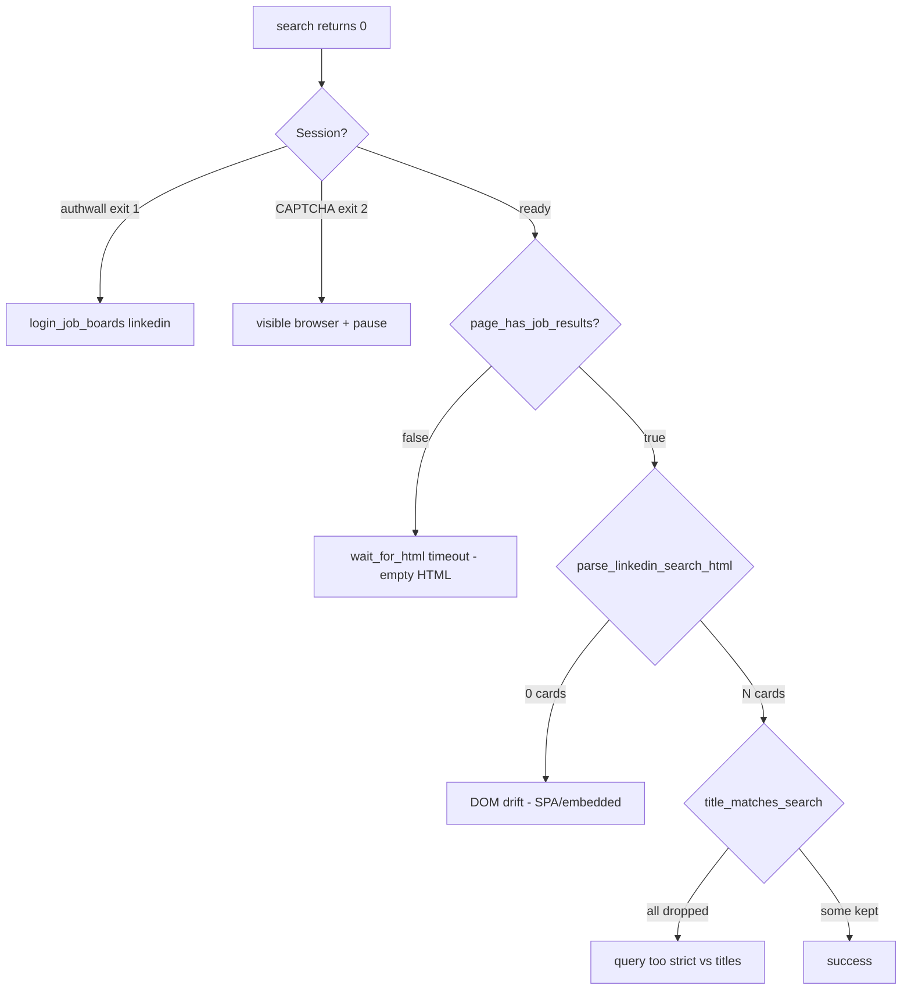
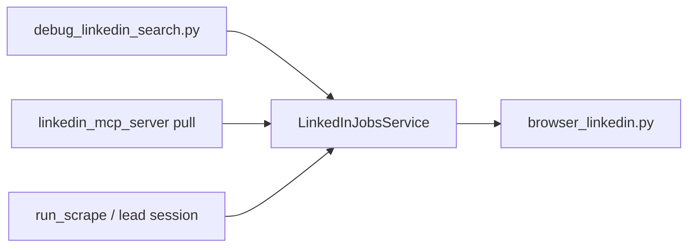

# LinkedIn scrape reliability (local debug loop)

## Mission

Make LinkedIn job search **return a stable, non-empty list** when run locally in Python (Playwright profile and optional CDP), using an iterative debug harness and fixture-backed fixes. **Done** when a documented live command returns **≥ 3 parsed rows** for a realistic security-engineer query, unit tests stay green, and production `run_scrape` uses the same code path as the jobs MCP service.

**Execution posture (locked by you):** After you approve this plan, the Agent **does not ask clarifying questions**—it loops plan → `PROGRESS.md` → implement → Accept → `WORKLOG.md` until live gate passes or **give-up** criteria fire.

## Locked decisions

| Decision | Choice |
|----------|--------|
| Scope | **Reliability only** — not the full [linkedin-first-ingest.plan.md](docs/linkedin-first-ingest.plan.md) epic (Indeed/Glassdoor removal, README regen deferred) |
| Primary code path | [`LinkedInJobsService`](agentzero/scrape/linkedin_jobs.py) becomes the **single** browser search implementation; [`BrowserJobBoardSource`](agentzero/scrape/browser_board.py) LinkedIn branch delegates or is replaced (T06) |
| Debug surface | New **`scripts/debug_linkedin_search.py`** — verbose stderr + optional HTML snapshot under `data/debug/` (gitignored) |
| Browser modes | Harness runs **profile first**; `--cdp` flag forces CDP path; **do not** hard-require CDP in operator scripts after T02 |
| Entry points covered | `pull_linkedin_jobs`, `run_scrape`, `run_linkedin_lead_scrape` all converge on service after T06 |
| Untracked code | Commit existing untracked LinkedIn stack in **T01** ([`linkedin_jobs.py`](agentzero/scrape/linkedin_jobs.py), [`linkedin_mcp_format.py`](agentzero/scrape/linkedin_mcp_format.py), [`linkedin_mcp_server.py`](agentzero/linkedin_mcp_server.py), tests, [`scripts/run_linkedin_jobs_mcp.py`](scripts/run_linkedin_jobs_mcp.py)) as baseline |
| Live tests | Allowed **only** via `@pytest.mark.external` or explicit `--live` on debug script; never in default `pytest -q` |
| Autonomous loop | Re-read **only** [plan](docs/linkedin-scrape-reliability.plan.md) + [`PROGRESS.md`](PROGRESS.md); append [`WORKLOG.md`](WORKLOG.md); stop between tasks |
| Give-up | After **3** live debug runs with `login_required=false` and `blocked=false` still **0 post-filter records**, OR **5** iterations with no new failing-test signal — log root cause in `WORKLOG.md` and stop |
| HITL | CAPTCHA/consent: run **visible** browser (`AGENTZERO_SCRAPE_BROWSER_HEADLESS=false`, pause on); operator solves in window — Agent does not stall waiting for chat |
| PR strategy | **One branch** `fix/linkedin-scrape-reliability` for the whole epic (iterative commits); **one prep-pr** after T07 live gate (debug epics are too chatty for six micro-PRs) |
| Out of scope | Pagination/infinite scroll; LinkedIn auto-apply; removing Indeed/Glassdoor |

## Root-cause hypothesis (from repo state)



Known gaps today:

- **Dual paths:** [`factory.py`](agentzero/scrape/factory.py) → `BrowserJobBoardSource` (no empty reload loop) vs **untracked** [`LinkedInJobsService`](agentzero/scrape/linkedin_jobs.py) (one reload, structured `login_required`).
- [`scripts/run_linkedin_lead_scrape.py`](scripts/run_linkedin_lead_scrape.py) **forces** `scrape_cdp_sites=["linkedin"]` — can scrape the wrong Chrome vs `data/browser_profiles/linkedin`.
- [`PROGRESS.md`](PROGRESS.md) P17h: live LinkedIn **exit 1** (authwall) — session often the real blocker before parser work.
- Parser may pass fixtures but fail live if `_JOB_MARKERS` or SPA dismiss selectors drift.

## Architecture (target)



## Build-loop contract

Per [docs/BUILD_STORY.md](docs/BUILD_STORY.md) and ralph build-loop:

1. Copy/commit this plan as [`docs/linkedin-scrape-reliability.plan.md`](docs/linkedin-scrape-reliability.plan.md).
2. Add checklist section to [`PROGRESS.md`](PROGRESS.md) (T01–T07).
3. Each iteration: first unchecked task → branch `fix/linkedin-scrape-reliability` → red test → fix → Accept → check box → append `WORKLOG.md` → commit.
4. **No user prompts** except visible-browser CAPTCHA; record session exit codes in `WORKLOG.md`.
5. Epic ends with **prep-pr** on `fix/linkedin-scrape-reliability` (user says `prep-pr`).

## Git + PR workflow

- Branch: **`fix/linkedin-scrape-reliability`** (off `main` / default).
- Commits per task (T01…T07) on same branch.
- **prep-pr once** after T07 Accept + `python tools/codeql_check.py` green.

## Test / quality standard

```powershell
pip install -e ".[dev,scrape,llm,mcp,web]"
ruff check agentzero tests scripts tools
pytest -q
python tools/codeql_check.py
```

Task-level Accept uses **narrow** pytest paths. Live gate is explicit `--live` (not default suite).

## Security gate

- `python tools/codeql_check.py` before push (pre-push hook parity).
- Debug snapshots may contain PII — **gitignore** `data/debug/`; never commit raw HTML unless redacted fixture.

## Parallel execution

Sequential DAG (findings from T02 inform T03–T05):

| Wave | Tasks |
|------|--------|
| 1 | T01 |
| 2 | T02 |
| 3 | T03 → T04 → T05 (parser → filter telemetry → navigation) |
| 4 | T06 |
| 5 | T07 + prep-pr |

## Task ledger

### T01 — Track LinkedIn service stack + debug telemetry types

- **Branch:** `fix/linkedin-scrape-reliability`
- **Files:** [`agentzero/scrape/linkedin_jobs.py`](agentzero/scrape/linkedin_jobs.py), [`agentzero/scrape/linkedin_mcp_format.py`](agentzero/scrape/linkedin_mcp_format.py), [`agentzero/linkedin_mcp_server.py`](agentzero/linkedin_mcp_server.py), [`scripts/run_linkedin_jobs_mcp.py`](scripts/run_linkedin_jobs_mcp.py), [`tests/scrape/test_linkedin_jobs.py`](tests/scrape/test_linkedin_jobs.py), [`tests/scrape/test_linkedin_mcp_format.py`](tests/scrape/test_linkedin_mcp_format.py), [`tests/test_linkedin_mcp.py`](tests/test_linkedin_mcp.py), [`.gitignore`](.gitignore) (`data/debug/`)
- **Test-first:** Extend `LinkedInSearchResult` with optional debug fields (`parsed_raw`, `after_title_filter`, `session_state`); `test_search_result_debug_fields_default_none`.
- **Accept:** `pytest tests/scrape/test_linkedin_jobs.py tests/scrape/test_linkedin_mcp_format.py tests/test_linkedin_mcp.py -q` → 0 failures.
- **Ship:** commit on epic branch (prep-pr deferred to T07).

### T02 — Local debug harness + session matrix

- **Branch:** `fix/linkedin-scrape-reliability`
- **Files:** [`scripts/debug_linkedin_search.py`](scripts/debug_linkedin_search.py) (new), [`tests/scripts/test_debug_linkedin_search.py`](tests/scripts/test_debug_linkedin_search.py) (new), [`scripts/run_linkedin_lead_scrape.py`](scripts/run_linkedin_lead_scrape.py) (remove forced CDP; use env/profile), [`agentzero/scrape/linkedin_jobs.py`](agentzero/scrape/linkedin_jobs.py) (populate debug fields in `search()`)
- **Test-first:** `test_debug_cli_prints_json_summary_mocked`, `test_debug_cli_live_flag_requires_explicit`.
- **Accept:** `pytest tests/scripts/test_debug_linkedin_search.py -q` → 0 failures; `python scripts/debug_linkedin_search.py --help` → exit 0.
- **Agent loop (manual/live, not pytest):** Run `python scripts/verify_browser_session.py --site linkedin` and `python scripts/debug_linkedin_search.py --dry-run` (mocked Accept above); then **one** real `python scripts/debug_linkedin_search.py` (profile) logging `session_state`, marker hit, `parsed_raw` vs `after_title_filter`. Record in `WORKLOG.md`.

### T03 — Parser / marker hardening from captured HTML

- **Branch:** `fix/linkedin-scrape-reliability`
- **Files:** [`agentzero/scrape/browser_linkedin.py`](agentzero/scrape/browser_linkedin.py), [`tests/scrape/test_browser_scrape.py`](tests/scrape/test_browser_scrape.py) (LinkedIn section), optional new fixture [`tests/fixtures/linkedin_search_live_sample.html`](tests/fixtures/linkedin_search_live_sample.html) (redacted from `data/debug/` capture)
- **Test-first:** Failing test against new fixture or tightened assertion on `page_has_job_results` / `parse_linkedin_search_html` count ≥ 1.
- **Accept:** `pytest tests/scrape/test_browser_scrape.py -k linkedin tests/scrape/test_linkedin_jobs.py -q` → 0 failures.

### T04 — Empty-after-parse diagnostics + title-filter guardrails

- **Branch:** `fix/linkedin-scrape-reliability`
- **Files:** [`agentzero/scrape/linkedin_jobs.py`](agentzero/scrape/linkedin_jobs.py), [`agentzero/scrape/title_filter.py`](agentzero/scrape/title_filter.py) (only if tests prove over-filtering), [`tests/scrape/test_title_filter.py`](tests/scrape/test_title_filter.py), [`scripts/debug_linkedin_search.py`](scripts/debug_linkedin_search.py)
- **Test-first:** `test_parse_with_retry_reports_dropped_titles` (mock HTML with mixed titles); ensure debug output shows `parsed_raw=2, after_title_filter=1` pattern.
- **Accept:** `pytest tests/scrape/test_linkedin_jobs.py tests/scrape/test_title_filter.py -q` → 0 failures.

### T05 — Navigation reliability (waits, reload, optional scroll)

- **Branch:** `fix/linkedin-scrape-reliability`
- **Files:** [`agentzero/scrape/linkedin_jobs.py`](agentzero/scrape/linkedin_jobs.py), [`agentzero/scrape/browser_common.py`](agentzero/scrape/browser_common.py) (only if shared wait helper needed), [`tests/scrape/test_linkedin_jobs.py`](tests/scrape/test_linkedin_jobs.py)
- **Test-first:** `test_search_waits_for_network_idle_or_scroll_before_parse` (mocked page); extend `test_search_retries_transient_empty` if reload count changes.
- **Accept:** `pytest tests/scrape/test_linkedin_jobs.py -q` → 0 failures.

### T06 — Unify production scrape on LinkedInJobsService

- **Branch:** `fix/linkedin-scrape-reliability`
- **Files:** [`agentzero/scrape/browser_board.py`](agentzero/scrape/browser_board.py) or thin [`agentzero/scrape/linkedin_source.py`](agentzero/scrape/linkedin_source.py), [`agentzero/scrape/factory.py`](agentzero/scrape/factory.py), [`agentzero/leads/session.py`](agentzero/leads/session.py), [`tests/scrape/test_browser_boards.py`](tests/scrape/test_browser_boards.py), [`tests/test_leads_session.py`](tests/test_leads_session.py)
- **Test-first:** `test_linkedin_browser_source_delegates_to_service` — factory LinkedIn fetch returns same records as service for fixture/mocks.
- **Accept:** `pytest tests/scrape/test_browser_boards.py tests/test_leads_session.py tests/scrape/test_factory.py -q` → 0 failures.

### T07 — Live acceptance gate + prep-pr

- **Branch:** `fix/linkedin-scrape-reliability`
- **Files:** [`docs/SCRAPING.md`](docs/SCRAPING.md) (short “debug LinkedIn” section), [`tests/scrape/test_linkedin_live.py`](tests/scrape/test_linkedin_live.py) (new, `@pytest.mark.external`)
- **Test-first:** `test_linkedin_live_search_returns_minimum_rows` skipped unless `AGENTZERO_LINKEDIN_LIVE=1`.
- **Accept (live):** With logged-in profile and visible browser if needed:

```powershell
$env:AGENTZERO_SCRAPE_BROWSER_HEADLESS='false'
$env:AGENTZERO_SCRAPE_BROWSER_PAUSE_FOR_CAPTCHA='true'
python scripts/verify_browser_session.py --site linkedin
# expect exit 0
python scripts/debug_linkedin_search.py --terms "Staff Security Engineer" --locations "Remote - USA" --remote
# expect: after_title_filter >= 3, login_required=false
```

- **Accept (CI):** `pytest -q` and `ruff check agentzero tests scripts tools` → clean.
- **Ship:** User invokes **prep-pr** on `fix/linkedin-scrape-reliability`; record PR URL + CodeQL pass in `WORKLOG.md`; check all T01–T07 in `PROGRESS.md`.

## Bootstrap `PROGRESS.md` (initial contents)

```markdown
## LinkedIn scrape reliability (T01–T07)
- [ ] T01 — Track service stack + debug telemetry
- [ ] T02 — Debug harness + session matrix
- [ ] T03 — Parser / marker hardening
- [ ] T04 — Title-filter diagnostics
- [ ] T05 — Navigation reliability
- [ ] T06 — Unify factory on LinkedInJobsService
- [ ] T07 — Live gate + prep-pr
```

## Optional `prd.json` (snarktank Ralph)

```json
{
  "branchName": "fix/linkedin-scrape-reliability",
  "userStories": [
    {
      "id": "T01",
      "title": "Track LinkedIn service + debug fields",
      "priority": 1,
      "passes": false,
      "acceptanceCriteria": [
        "Failing test: test_search_result_debug_fields_default_none",
        "Accept: pytest tests/scrape/test_linkedin_jobs.py tests/scrape/test_linkedin_mcp_format.py tests/test_linkedin_mcp.py -q"
      ]
    }
  ]
}
```

(Extend with T02–T07 mirroring ledger.)

## Agent execution (after you approve)

1. Create branch `fix/linkedin-scrape-reliability`.
2. Run T01→T07 without further questions; use `WORKLOG.md` for each live attempt.
3. If `verify_browser_session.py` returns **exit 1**, run `python scripts/login_job_boards.py --site linkedin` once (visible), then retry debug script.
4. Compare profile vs `--cdp` in `WORKLOG.md`; prefer profile unless CDP proves strictly better.
5. When T07 live Accept passes, say **`prep-pr`** (or “prep this branch”) for review/CI/CodeQL.

## Confirm before execution

- Single branch + one prep-pr at end is acceptable.
- You can complete **one** interactive LinkedIn login/CAPTCHA in a visible Chrome window if the loop hits authwall (no chat back-and-forth otherwise).
