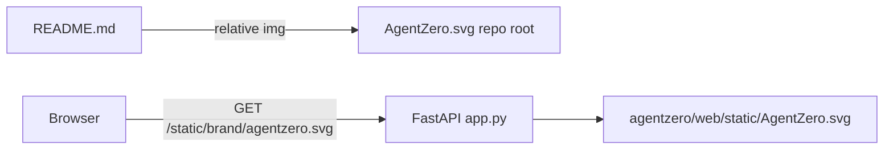

## Mission

Operators and GitHub visitors see the **AgentZero** mark in the **README** and on every **web tracker** page header, using the existing `AgentZero.svg` artwork. Done when branding is served from a **fixed package path** (no path traversal), Docker/web installs include the asset, tests assert README + HTML + SVG route, and **prep-pr** passes **master-code-review** with zero open findings.

## Locked decisions

| Topic | Decision |
|-------|----------|
| Canonical web asset | `agentzero/web/static/AgentZero.svg` (packaged with the app) |
| README | Centered `` at repo root (GitHub-rendered) — same bytes as web static |
| Route | `GET /static/brand/agentzero.svg` — constant path only; `FileResponse` + `image/svg+xml` |
| Auth | N/A — public branding asset (local tracker has no auth v1) |
| Scope | README + `base.html` header only (no favicon in v1) |

## Architecture

## Build-loop contract

`PROGRESS.md` checkbox → task branch → failing test → implement → Accept → **prep-pr** → `WORKLOG.md`.

## Git + PR workflow

- Branch: `feat/logo-T01-branding` from `main`
- **prep-pr** after Accept (ruff, pytest, `python tools/codeql_check.py` when CodeQL CLI available)
- No implementation commits on `main` without user request

## Test / quality standard

- `ruff check agentzero tests scripts tools`
- `pytest tests/test_web_brand.py tests/test_docs_web.py -q`
- Optional full: `pytest --cov=agentzero -q`
- Pre-push: `python tools/codeql_check.py` (GHAS parity)

## Security gate

- Static route must not accept user-controlled paths (CodeQL path-injection safe)
- SVG served with `media_type=image/svg+xml` only

## Task ledger

- **T01** — Brand logo in README and web header. Branch: `feat/logo-T01-branding`.
  Files: `AgentZero.svg`, `agentzero/web/static/AgentZero.svg`, `agentzero/web/app.py`, `agentzero/web/templates/base.html`, `README.md`, `pyproject.toml`, `tests/test_web_brand.py`, `tests/test_docs_web.py`.
  Test-first: `test_brand_logo_route_returns_svg`, `test_chat_page_header_includes_brand_logo`, `test_readme_includes_agentzero_svg`.
  Accept: `pytest tests/test_web_brand.py tests/test_docs_web.py -q` → 0 failures; `ruff check agentzero/web/app.py agentzero/web/templates/base.html tests/test_web_brand.py` → clean.
  Ship: prep-pr on `feat/logo-T01-branding` → PR URL.

## Optional: Agent execution

Single-story epic; no `prd.json` required unless using external Ralph.sh.
