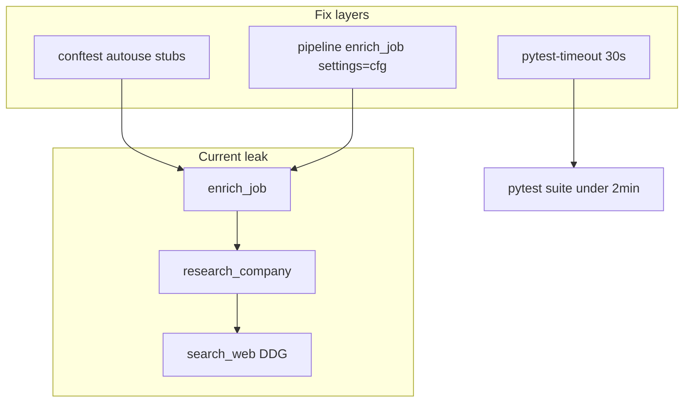
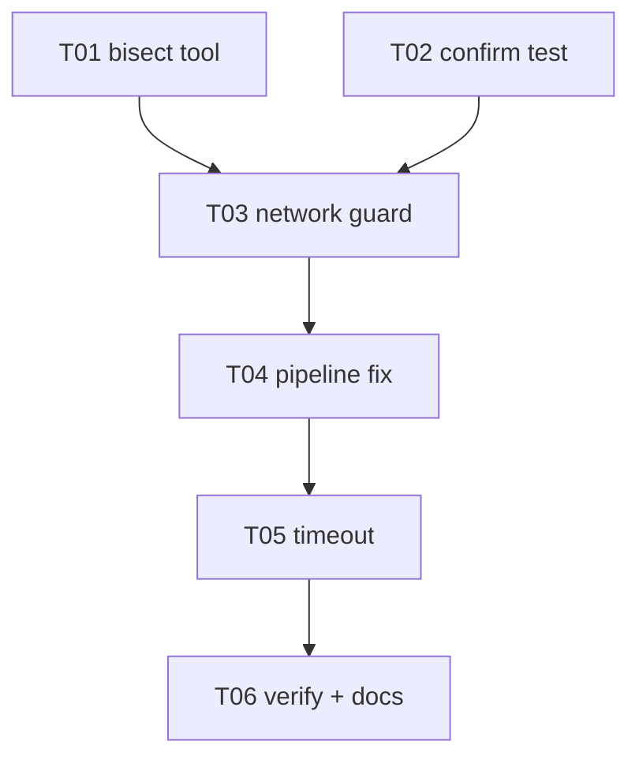

# Pytest suite hang — diagnosis and fix

Plan: `.cursor/plans/pytest_hang_diagnosis_1b9ce562.plan.md` (Cursor copy; this file is the durable ledger).

## Mission

Operators and CI expect **`pytest -q` to finish in ~1–2 minutes**. After P43 enrichment, several unit tests call **live DuckDuckGo/Glassdoor HTTP** via default `enrich_web_search=True`, causing multi-minute stalls or indefinite hangs (especially on Windows). Fix network leakage, pass pipeline settings through, add **pytest-timeout** and a **conftest guard**, ship via **one PR per task** with **prep-pr → babysit** and **CodeQL** before push.

## Locked decisions

| Topic | Decision |
|-------|----------|
| Live HTTP in unit tests | **Forbidden** — stub in conftest + explicit `enrich_web_search=False` where needed |
| Production default | Keep `enrich_web_search=True` for operators; tests override via Settings/conftest |
| pytest-socket | **Optional follow-up** — conftest stubs sufficient for v1 |
| DDGS production timeout | **Follow-up epic** (not blocking this ledger) |
| Branch prefix | `feat/pytest-hang-` |
| PR policy | **One PR per task**; merge to `main` before dependent task |

## Architecture



## Build-loop contract

Per [build-loop contract](https://github.com/snarktank/ralph/blob/main/references/build-loop-contract.md) / `c:\Users\Dan\.cursor\skills\ralph-this-plz\references\build-loop-contract.md`:

1. Re-read this plan + [`PROGRESS.md`](../PROGRESS.md) → first unchecked task.
2. Branch `feat/pytest-hang-<TaskId>-<short>` from `main`.
3. Failing tests → implement → **Accept** green on task branch.
4. **`/master-code-review`** on branch diff vs `main` — empty finding sections.
5. **`/prep-pr`** (local CI + `CODEQL_CLI=… python tools/codeql_check.py`).
6. **`/babysit`** until GitHub CI green.
7. Check `PROGRESS.md`; append `WORKLOG.md` `DONE` with PR URL + `CodeQL: pass`.

## Git + PR workflow

- Prefix: `feat/pytest-hang-`
- **Never** commit on `main`; never commit `.env`, `data/web_operator_config.json`, `token.json`.
- Task done = Accept green + prep-pr PR URL + CodeQL pass.

## Parallel execution



| Wave | Tasks |
|------|--------|
| 1 | **T01**, **T02** (no file overlap) |
| 2 | **T03** |
| 3 | **T04** |
| 4 | **T05** |
| 5 | **T06** |

## Test / quality standard

```text
ruff check agentzero tests scripts tools
pytest --cov=agentzero --cov-branch -q --durations=15
python tools/encoding_check.py
CODEQL_CLI=<path>/codeql.exe python tools/codeql_check.py
```

Full suite target: **<120s** locally after T06.

## Security gate

- Conftest stubs must not weaken SSRF tests in `tests/test_http_client.py` (patch at import site used by enrich, not test-local mocks).
- CodeQL before push when GHAS enabled.

## Live API audit (summary)

**Live today:** DuckDuckGo + Glassdoor via `enrich_job()` → `research_company()` in [`tests/test_enrich.py`](../tests/test_enrich.py) (`test_enrich_job_runs_all_steps`, ~47% collection) and [`tests/test_loops.py`](../tests/test_loops.py) pipeline tests (~60%).

**Not live:** OpenAI/Anthropic (FakeLLM), Google APIs, Playwright (mocked), MCP `--help` subprocess, CDP loopback.

See Cursor plan for full audit tables.

## Task ledger

### T01 — Pytest bisect tool

- **Branch:** `feat/pytest-hang-T01-bisect-tool`
- **Files:** [`tools/pytest_bisect.py`](../tools/pytest_bisect.py), [`tests/test_pytest_bisect.py`](../tests/test_pytest_bisect.py)
- **Test-first:** `test_bisect_collects_modules`, `test_bisect_records_timeout_as_hang`
- **Accept:** `pytest tests/test_pytest_bisect.py -q && python tools/pytest_bisect.py --dry-run` → 0 failures; dry-run lists test modules
- **Ship:** master-code-review → prep-pr → babysit

Tool behavior: file-level `subprocess.run(pytest file, timeout=45)`; resume JSON at `data/pytest-bisect.json`.

---

### T02 — Confirm enrich_job live-network suspect

- **Branch:** `feat/pytest-hang-T02-confirm-suspect`
- **Files:** [`tests/test_no_live_network.py`](../tests/test_no_live_network.py) (red test documenting bug), [`tests/test_enrich.py`](../tests/test_enrich.py)
- **Test-first:** `test_enrich_job_runs_all_steps_completes_under_one_second` (fails until T03/T04 fixes or local `search_web` stub)
- **Accept:** `pytest tests/test_enrich.py::test_enrich_job_runs_all_steps -q --no-cov` completes in **<5s** (after T03 merged, or stub in this test only for T02 red→green scope: assert `search_web` call count == 0 via mock)
- **Note:** T02 can land as **failing test + skip reason** if merged before T03; prefer **stack T02 after T03** or combine T02 accept into T03.
- **Ship:** prep-pr → babysit

---

### T03 — Conftest no-live-network guard

- **Branch:** `feat/pytest-hang-T03-conftest-guard`
- **Files:** [`tests/conftest.py`](../tests/conftest.py), [`tests/test_no_live_network.py`](../tests/test_no_live_network.py)
- **Test-first:** `test_search_web_stubbed_by_default`, `test_safe_get_text_stubbed_by_default`
- **Accept:** `pytest tests/test_no_live_network.py tests/test_enrich.py::test_enrich_job_runs_all_steps -q` → 0 failures, **<5s** total
- **Implementation:** autouse fixture stubs `search_web` → `[]`, `safe_get_text` → `None`, `AGENTZERO_ENRICH_WEB_SEARCH=false`
- **Ship:** prep-pr → babysit

---

### T04 — Pipeline settings pass-through + explicit test Settings

- **Branch:** `feat/pytest-hang-T04-pipeline-settings`
- **Files:** [`agentzero/loops/pipeline.py`](../agentzero/loops/pipeline.py), [`tests/test_loops.py`](../tests/test_loops.py), [`tests/test_enrich.py`](../tests/test_enrich.py)
- **Test-first:** `test_pipeline_backfill_enrich_uses_run_settings` (monkeypatch `enrich_job`, assert `settings=` passed); loops Settings include `enrich_web_search=False`
- **Accept:** `pytest tests/test_loops.py tests/test_enrich.py -q` → 0 failures
- **Production:** `enrich_job(job, settings=cfg)` in backfill and `_enrich_scraped_job` paths
- **Ship:** prep-pr → babysit

---

### T05 — pytest-timeout + slow marks

- **Branch:** `feat/pytest-hang-T05-pytest-timeout`
- **Files:** [`pyproject.toml`](../pyproject.toml), [`tests/test_web_chat_store.py`](../tests/test_web_chat_store.py), [`CONTRIBUTING.md`](../CONTRIBUTING.md)
- **Test-first:** (config) full suite no test exceeds 30s except `@pytest.mark.slow`
- **Accept:** `pip install -e ".[dev]" && pytest tests/test_web_chat_store.py -q` → green; `pytest -q --durations=5` → nothing >30s except slow-marked
- **Implementation:** add `pytest-timeout>=2.3` to dev deps; `addopts = "... --timeout=30 --timeout_method=thread"`; mark chat store test `@pytest.mark.slow` + `@pytest.mark.timeout(10)`
- **Ship:** prep-pr → babysit

---

### T06 — Full gate + no-live-network policy doc

- **Branch:** `feat/pytest-hang-T06-verify-docs`
- **Files:** [`CONTRIBUTING.md`](../CONTRIBUTING.md), [`PROGRESS.md`](../PROGRESS.md) (checkbox section)
- **Test-first:** N/A (verification task)
- **Accept:**

  ```text
  ruff check agentzero tests scripts tools
  pytest --cov=agentzero --cov-branch -q --durations=15
  python tools/encoding_check.py
  CODEQL_CLI=<path>/codeql.exe python tools/codeql_check.py
  ```

  All green; pytest wall clock **<120s**; CONTRIBUTING documents **no live HTTP in unit tests** and `@pytest.mark.external` for opt-in integration runs (`pytest -m external`, excluded from CI).

- **Ship:** prep-pr → babysit

## PROGRESS.md bootstrap (append on approval)

```markdown
## Pytest hang fix
Plan: docs/pytest-hang-diagnosis.plan.md
- [ ] T01 Bisect tool
- [ ] T02 Confirm suspect test
- [ ] T03 Conftest network guard
- [ ] T04 Pipeline settings pass-through
- [ ] T05 pytest-timeout
- [ ] T06 Full gate + docs
```

## Agent execution handoff

**Wave 1:**

```text
git checkout main && git pull
git checkout -b feat/pytest-hang-T01-bisect-tool
# TDD → Accept → prep-pr → babysit → merge
```

Parallel **T02** only after T03 if using strict red-first on live-network assertion.

## Already on branch (keep)

- [`tests/test_cost.py`](../tests/test_cost.py) — search-profile cache isolation
- [`tests/test_enrich_io.py`](../tests/test_enrich_io.py) — `_facts_incomplete` after P43
- [`tests/test_web_job_card.py`](../tests/test_web_job_card.py) — CodeQL-safe assertion

## Follow-up (out of ledger)

- **DDGS bounded timeout** in [`agentzero/enrich/web_search.py`](../agentzero/enrich/web_search.py)
- **pytest-socket** with `127.0.0.1` allowlist
- CDP proxy test lifecycle cleanup
