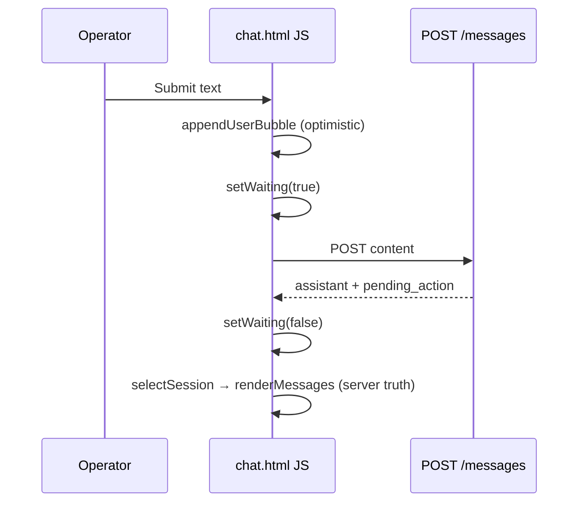

## Mission

When an operator sends a message on the default **Chat** page (`/`), they immediately see **their own text** in the thread (no blank gap until the round-trip finishes). While the assistant is processing, the UI shows a clear **waiting-for-reply** state (spinner or status line + disabled send) so it is obvious the API call is in flight. Behavior matches existing non-streaming `POST /api/chat/sessions/{id}/messages` — no backend contract change required.

**Done when:** P39a Accept is green, **prep-pr** opens a PR, GitHub CodeQL passes, and manual check on `docker compose up web` shows echo + waiting + final assistant reply after reload.

## Locked decisions

| Topic | Decision |
|-------|----------|
| Scope | **Client-only** — `agentzero/web/templates/chat.html` (+ tests); no API/store changes |
| Echo timing | **Optimistic** — append user bubble on submit, before `fetch` completes |
| After success | `selectSession` / `renderMessages` **replaces** thread from server (drops `data-optimistic` nodes; no duplicate user rows) |
| On error | Keep echoed user text; show inline error (not only `alert`); clear waiting state; re-enable input |
| Waiting UI | Status row in thread (`aria-live="polite"`) + disable **Send** and textarea during in-flight request |
| HITL | Waiting state ends when POST returns; existing HITL card unchanged |
| Streaming | Out of scope (P38 v1 JSON) |
| Auth | N/A — local web UI |

## Architecture



| Piece | Role |
|-------|------|
| `appendUserBubble(text)` | Build `.chat-msg-user` with `data-optimistic="1"`; hide `#chat-empty` |
| `setWaiting(on)` | Toggle `#chat-waiting`; disable `#chat-send` / `#chat-input` |
| `renderMessages` | Unchanged roles; skips `tool`; full replace removes optimistic nodes |

## Build-loop contract

Per [build-loop-contract](https://github.com/snarktank/ralph/blob/main/README.md) / repo `docs/BUILD_STORY.md`:

1. Re-read this plan + `PROGRESS.md` (P39a checkbox).
2. Branch `feat/chat-ux-P39a-send-feedback` from `main`.
3. TDD: extend `tests/test_web_chat_ui.py` for DOM hooks + script markers **before** JS behavior.
4. Implement in `chat.html` only.
5. Accept → **prep-pr** → record PR in `WORKLOG.md` with CodeQL pass.

## Git + PR workflow

- **One branch per task:** `feat/chat-ux-P39a-send-feedback`
- **Never** implement on `main`
- After Accept: user invokes **`prep-pr`** (review, CI, `CODEQL_CLI` e.g. `C:\Users\Dan\Projects\codeql\codeql.exe`, push, `gh pr create`)
- **Done** when checkbox checked + PR URL + CodeQL green

## Parallel execution

Single task — no DAG.

| Wave | Tasks |
|------|--------|
| 1 | P39a |

## Test / quality standard

```text
ruff check agentzero tests scripts tools
pytest --cov=agentzero --cov-branch --cov-report=term-missing:skip-covered -q
python tools/encoding_check.py
CODEQL_CLI=<path>/codeql.exe python tools/codeql_check.py
docker build -t agentzero:ci .
```

Task Accept (subset):

```text
pytest tests/test_web_chat_ui.py -q
```

## Security gate

- No new routes; optimistic HTML uses existing `escapeHtml` — no `innerHTML` with raw user text
- CodeQL on PRs: local `codeql_check` before push (pre-push hook)
- XSS: user content only via `textContent` / `escapeHtml` path (same as `renderMessages`)

## Task ledger

- **P39a** — Optimistic user echo and API waiting indicator. Branch: `feat/chat-ux-P39a-send-feedback`.
  Files: `agentzero/web/templates/chat.html`, `tests/test_web_chat_ui.py`.
  Test-first: `test_chat_page_has_waiting_indicator` (expects `#chat-waiting`, `aria-live`, default hidden); `test_chat_page_script_supports_optimistic_user_echo` (expects `appendUserBubble` and `setWaiting` in page script).
  Accept: `pytest tests/test_web_chat_ui.py -q` → 0 failures.
  Ship: prep-pr on `feat/chat-ux-P39a-send-feedback` → PR URL.
  Verify (manual): `docker compose up web` → send message → user bubble appears immediately → “waiting” visible → assistant reply after response.

## PROGRESS.md bootstrap (append under Post-MVP)

```markdown
## P39 — Web chat send UX

Plan: [docs/web-chat-ux.plan.md](docs/web-chat-ux.plan.md)

- [x] P39a Optimistic user echo + waiting indicator
```

## Optional: prd.json

```json
{
  "branchName": "ralph/web-chat-ux",
  "userStories": [
    {
      "id": "P39a",
      "title": "Optimistic user echo and waiting indicator",
      "description": "Show submitted user text immediately; indicate API in-flight until POST returns.",
      "acceptanceCriteria": [
        "Failing test: test_chat_page_has_waiting_indicator",
        "Failing test: test_chat_page_script_supports_optimistic_user_echo",
        "Accept: pytest tests/test_web_chat_ui.py -q on feat/chat-ux-P39a-send-feedback",
        "Ship: prep-pr → PR URL; CodeQL pass",
        "Verify: docker compose up web — send shows echo + waiting + reply"
      ],
      "priority": 1,
      "passes": false,
      "notes": "Files: chat.html, test_web_chat_ui.py"
    }
  ]
}
```

## Optional: Agent execution

```text
git checkout main && git pull
git checkout -b feat/chat-ux-P39a-send-feedback
# Write failing tests in tests/test_web_chat_ui.py
# Edit agentzero/web/templates/chat.html
pytest tests/test_web_chat_ui.py -q
# commit → prep-pr
```
