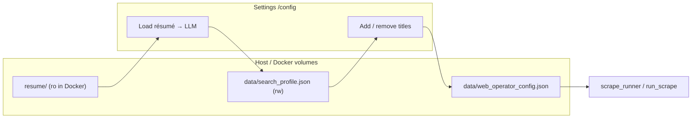
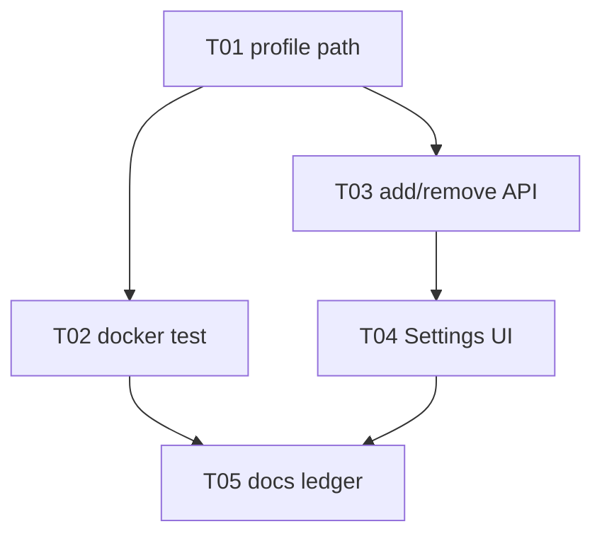

## Mission

Operators can **load a résumé** from Settings (including `docker compose up web`) without
`[Errno 30] Read-only file system` on `resume/search_profile.json`, and can **add or remove**
job titles in the Search titles section (not only toggle résumé-derived checkboxes).

Done when: Load résumé succeeds in Docker; custom titles persist in `web_operator_config.json`
and drive background scrape / effective search terms; docs updated; each task merged via prep-pr.

## Locked decisions

| Decision | Choice |
|----------|--------|
| Search profile snapshot path | **`data/search_profile.json`** (beside DB), not under `resume/` |
| `resume/` in Docker | Stays **read-only** for résumé files; no `:ro` removal required |
| Backward compat | On load, if `data/search_profile.json` missing, fall back to `resume/search_profile.json` |
| Custom titles | Stored in operator config; merged with résumé-derived terms for scrape |
| Title remove | Removes from operator active list; résumé profile unchanged until re-load |
| Branch prefix | `feat/web-P33-` |
| PR policy | One PR per task via **prep-pr** after Accept green |

## Architecture



## Build-loop contract

Per [references/build-loop-contract.md](.cursor/skills/ralph-this-plz/references/build-loop-contract.md):

- Re-read this plan + `PROGRESS.md` each iteration (not full `WORKLOG.md`).
- One branch per task; TDD red-first; **prep-pr** before checking the box.

## Git + PR workflow

1. Branch from `main`: `feat/web-P33-T0x-short-name`
2. Commit implementation + tests on that branch only
3. Run task **Accept** locally
4. User/agent invokes **prep-pr** → review, `ruff`, `pytest`, `gh pr create`
5. Merge PR; next task branches from updated `main`
6. Append `WORKLOG.md` DONE with branch + PR URL

## Test / quality standard

```bash
ruff check agentzero tests scripts tools
pytest --cov=agentzero --cov-branch --cov-report=term-missing:skip-covered -q
python tools/encoding_check.py
```

## Parallel execution

| Wave | Tasks | Notes |
|------|-------|-------|
| 1 | T01 | Unblocks résumé load; no file overlap with later tasks except shared `search_profile.py` |
| 2 | T02 | Depends T01 (uses new path in tests) |
| 3 | T03 | Depends T01 for profile load in app |
| 4 | T04 | Depends T03 |
| 5 | T05 | Depends T02–T04 |



## Task ledger

- **T01 — Writable search profile in `data/`**. Branch: `feat/web-P33-T01-search-profile-data`.
  Files: `agentzero/ingest/search_profile.py`, `tests/test_search_profile.py`, `tests/test_web_resume_loader.py`.
  Test-first: `test_save_search_profile_writes_under_data_dir`; `test_load_search_profile_falls_back_to_resume_dir`; `test_save_succeeds_when_resume_dir_read_only`.
  Accept: `pytest tests/test_search_profile.py tests/test_web_resume_loader.py -q` → 0 failures; `ruff check agentzero/ingest/search_profile.py` → clean.
  Ship: prep-pr on branch → PR URL.

- **T02 — Docker/docs: profile path + résumé ro mount**. Branch: `feat/web-P33-T02-docker-docs`.
  Files: `docs/DOCKER.md`, `docs/GETTING_STARTED.md`, `README.md` (one line), `tests/test_docs_web.py`.
  Test-first: `test_docker_doc_mentions_data_search_profile` (or extend existing docker doc test).
  Accept: `pytest tests/test_docs_web.py -q`; `ruff check` on touched files → clean.
  Ship: prep-pr → PR URL.

- **T03 — Add/remove title helpers + routes**. Branch: `feat/web-P33-T03-title-mutations`.
  Files: `agentzero/web/search_titles.py`, `agentzero/web/operator_config.py`, `agentzero/web/app.py`, `tests/test_web_search_titles.py`, `tests/test_web_app_config.py`.
  Test-first: `test_add_custom_title_appends_to_operator`; `test_remove_title`; `test_effective_search_terms_includes_custom`; POST `/config/search-titles/add` and `/remove` return 303.
  Accept: `pytest tests/test_web_search_titles.py tests/test_web_app_config.py -q` → 0 failures.
  Ship: prep-pr → PR URL.

- **T04 — Settings UI: add/remove titles**. Branch: `feat/web-P33-T04-title-ui`.
  Files: `agentzero/web/templates/config.html`, `tests/test_web_app_config.py` (HTML assertions).
  Test-first: `test_config_page_shows_add_title_form`; `test_config_lists_custom_title_with_remove`.
  Accept: `pytest tests/test_web_app_config.py -q` → 0 failures.
  Ship: prep-pr → PR URL.

- **T05 — Ledger + WORKLOG bootstrap entry**. Branch: `feat/web-P33-T05-ledger`.
  Files: `PROGRESS.md`, `WORKLOG.md` (append P33 DONE summary after T01–T04 merged, or per-task DONE lines as you go).
  Test-first: `pytest tests/test_worklog_append_only.py -q` (if touching WORKLOG).
  Accept: `pytest tests/test_worklog_append_only.py -q`; PROGRESS shows P33a–e checked.
  Ship: prep-pr → PR URL (or fold into T04 PR if only ledger — prefer small T05 after merges).

## Implementation notes (for Agent)

### T01 — Root cause

`docker-compose.yml` mounts `./resume:/app/resume:ro`. `save_search_profile()` writes
`resume/search_profile.json` → **Errno 30**.

**Fix:** `search_profile_path()` resolves to `Settings.db_path.parent / "search_profile.json"`
(default `data/search_profile.json`). `load_search_profile()` tries data path first, then legacy
`resume/search_profile.json`. All save paths use data dir.

### T03 — Title model

- `OperatorScrapeConfig.search_terms`: when non-empty, **exact** scrape title list (may include strings not in résumé profile).
- Helpers: `add_operator_title(path, term)`, `remove_operator_title(path, term)`.
- `title_rows()`: union of profile terms + any operator-only terms; checkbox = in effective list.
- `effective_search_terms()`: return `operator.search_terms` if set, else full profile.
- Routes: `POST /config/search-titles/add` (`term`), `POST /config/search-titles/remove` (`term`); keep existing save for checkbox batch.

### T04 — UI sketch

Below checkboxes: text input + **Add title**; for each custom-only title, show label + **Remove** button (separate small forms or one form with `action`).

## PROGRESS.md bootstrap (append after P32)

```markdown
## P33 — Search titles: résumé load fix + add/remove (2026-06-02)

- [ ] P33a Writable `data/search_profile.json` (+ legacy resume fallback)
- [ ] P33b Docker/docs for profile path
- [ ] P33c Add/remove title API + operator merge logic
- [ ] P33d Settings UI add/remove
- [ ] P33e Ledger + gate
```

## Optional: prd.json

```json
{
  "branchName": "ralph/web-P33-search-titles",
  "userStories": [
    {
      "id": "US-001",
      "title": "Writable search profile in data/",
      "priority": 1,
      "passes": false,
      "notes": "Branch: feat/web-P33-T01-search-profile-data"
    },
    {
      "id": "US-002",
      "title": "Add/remove scrape titles in Settings",
      "priority": 2,
      "passes": false,
      "notes": "Branches: T03 + T04"
    }
  ]
}
```

## Out of scope

- Editing résumé PDF/DOCX in the browser
- Reordering titles (drag-and-drop)
- MCP `suggest_targets` UI parity (host CLI unchanged unless broken by path move)
