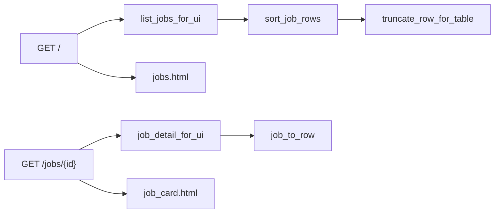
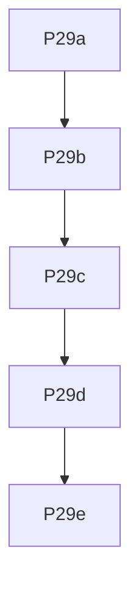

## Mission

Improve the Docker web job tracker (P28) so operators can **sort** the table by any column, scan rows without wall-of-text cells (**truncate** long values with full text on the job card), and open a **job card** detail view by clicking a row (full `job_to_row` fields including `match_rationale`, description if present, comp, dates, links).

**Done when:** `docker compose up web` supports `?sort=match_score&order=desc`, truncated table cells, and `GET /jobs/{job_id}` card with back-link preserving filters; each ledger task ships via **prep-pr**.

## Locked decisions

| Topic | Decision |
|-------|----------|
| UI style | Stay **server-rendered Jinja2** — no React/Vue in v1 |
| Sorting | **Server-side** via query params `sort=<column>` & `order=asc|desc`; column headers are links toggling order |
| Sortable columns | All `SHEET_COLUMNS` / `UI_COLUMNS` |
| Default sort | `match_score` **desc** (best fits first); falls back safely when unranked |
| Truncation | Python helper before template; table shows shortened text + `title` tooltip with full value |
| Truncate limits | `notes`/`url`: **80** chars; `title`/`company`/`location`: **48**; other columns: **32** (config constants in `display.py`) |
| Job card | Dedicated page **`GET /jobs/{job_id}`** (HTML); not a JS modal |
| Card data | `job_to_row()` from `csv_export` (full schema incl. `match_rationale`, `description` via DB `JobPosting`) |
| Row click | Entire data row navigates to detail except **actions** column (forms stay clickable) |
| Preserve state | Detail “Back to list” and sort links preserve `show_rejected`, `sort`, `order` |
| Mutations | Existing status/notes/nope forms unchanged; optional: repeat actions on card page in P29 follow-up — **out of scope v1** (card is read-only + back link) |
| Auth | Still none (local Docker) |
| Branch prefix | `feat/web-display-` |
| PR policy | **prep-pr** per task |

## Open questions (defaults if silent)

1. **Card edits** — read-only card in v1; edit only from table. OK?
2. **Default sort column** — `match_score` desc. Prefer `date_applied`?

*Defaults: read-only card; default sort `match_score` desc.*

## Architecture



| Module | Role |
|--------|------|
| `agentzero/web/display.py` | `truncate_display`, `sort_job_rows`, `TABLE_TRUNCATE_LIMITS`, `parse_sort_params` |
| `agentzero/web/jobs.py` | Extend `list_jobs_for_ui(..., sort, order)`; add `job_detail_for_ui(db, job_id)` |
| `agentzero/web/app.py` | Query params on `/`; new detail route; pass `sort_links` context |
| `templates/jobs.html` | Sortable `<th>` links, truncated `<td>`, row links |
| `templates/job_card.html` | Full-field card layout |

**URL examples**

- `/` — default sort  
- `/?sort=company&order=asc&show_rejected=1`  
- `/jobs/abc123def456` — card  
- `/jobs/abc123?show_rejected=1&sort=match_score&order=desc` — back link returns to same list state  

## Build-loop contract

Re-read this plan + [`PROGRESS.md`](../PROGRESS.md) (P29 section) → task branch → TDD → Accept → **prep-pr** → [`WORKLOG.md`](../WORKLOG.md).

## Git + PR workflow

One branch per task; never commit on `main`; **prep-pr** after each Accept.

## Parallel execution

Serial (templates + app touch same files).



| Wave | Tasks |
|------|--------|
| 1 | P29a |
| 2 | P29b |
| 3 | P29c |
| 4 | P29d |
| 5 | P29e |

## Test / quality standard

- `ruff check agentzero tests scripts tools`
- `pytest -q` (+ per-task `--cov=agentzero.web.display` etc.)
- `TestClient` with `Settings(_env_file=None)`

## Task ledger

### P29a — Display helpers (truncate + sort)

- **Branch:** `feat/web-display-P29a-display`
- **Files:** `agentzero/web/display.py`, `tests/test_web_display.py`
- **Test-first:** `test_truncate_short_unchanged`, `test_truncate_long_adds_ellipsis`, `test_sort_match_score_desc`, `test_sort_company_asc`, `test_sort_invalid_column_raises`, `test_parse_sort_params_defaults`
- **Accept:** `pytest tests/test_web_display.py --cov=agentzero.web.display --cov-fail-under=100 -q` → green
- **Ship:** prep-pr → PR URL

### P29b — List API: sort + table row shaping

- **Branch:** `feat/web-display-P29b-list-sort`
- **Files:** `agentzero/web/jobs.py`, `tests/test_web_jobs.py`
- **Test-first:** `test_list_jobs_sorted_by_match_score`, `test_list_jobs_invalid_sort_ignored_or_default`, `test_jobs_for_table_truncates_notes`
- **Accept:** `pytest tests/test_web_jobs.py tests/test_web_display.py -q` → green
- **Ship:** prep-pr → PR URL  
- **Notes:** `list_jobs_for_ui(..., sort: str | None = None, order: str = "desc")` returns rows with optional `_display` suffix keys or nested `display` dict per column for template.

### P29c — Index route + sortable truncated table

- **Branch:** `feat/web-display-P29c-table-ui`
- **Files:** `agentzero/web/app.py`, `agentzero/web/templates/jobs.html`, `tests/test_web_app_read.py`
- **Test-first:** `test_index_sort_query_reorders`, `test_index_header_links_include_sort`, `test_index_truncates_long_notes_in_html`
- **Accept:** `pytest tests/test_web_app_read.py --cov=agentzero.web.app --cov-fail-under=85 -q && ruff check agentzero/web tests/test_web_app_read.py` → green
- **Ship:** prep-pr → PR URL  
- **Notes:** Pass `sort`, `order`, `sort_links` (per-column next toggle URL) to template; data rows link to `/jobs/{job_id}` with query string preserved; `actions` cell not wrapped in row link.

### P29d — Job card detail page

- **Branch:** `feat/web-display-P29d-job-card`
- **Files:** `agentzero/web/jobs.py` (extend), `agentzero/web/app.py`, `agentzero/web/templates/job_card.html`, `tests/test_web_app_detail.py`
- **Test-first:** `test_job_detail_200`, `test_job_detail_404`, `test_job_card_shows_match_rationale`, `test_back_link_preserves_show_rejected`
- **Accept:** `pytest tests/test_web_app_detail.py tests/test_web_app_read.py -q` → green
- **Ship:** prep-pr → PR URL  
- **Notes:** `job_detail_for_ui` uses `db.get_job` + `job_to_row`; template sections: header (title/company), comp, scores, status/dates, links, notes, rationale (full text, no truncate).

### P29e — Docs + P29 gate

- **Branch:** `feat/web-display-P29e-done`
- **Files:** `docs/DOCKER.md`, `PROGRESS.md`, `WORKLOG.md` (append)
- **Test-first:** `tests/test_docs_web.py` — extend `test_docker_doc_mentions_sort_or_card`
- **Accept:** `pytest -q && ruff check agentzero tests scripts tools` → green; manual: sort column, click row → card, back link
- **Ship:** prep-pr → PR URL

## PROGRESS.md bootstrap

```markdown
## P29 — Web UI advanced display (sort, truncate, job card)

- [ ] P29a Display helpers (truncate + sort)
- [ ] P29b List API sort + table row shaping
- [ ] P29c Sortable truncated table
- [ ] P29d Job card detail page
- [ ] P29e Docs + P29 gate
- [ ] P29 done — sort, truncate, job card on :8080
```

## Out of scope (P30+)

- Client-side DataTables / virtual scroll
- Inline edit on job card
- JSON `GET /api/jobs/{id}` (easy add later)
- Full-text search / filters beyond `show_rejected`

## Related

- Builds on [web-ui-docker.plan.md](web-ui-docker.plan.md) (P28)
- **prep-pr** after each task; **babysit** after PR open
