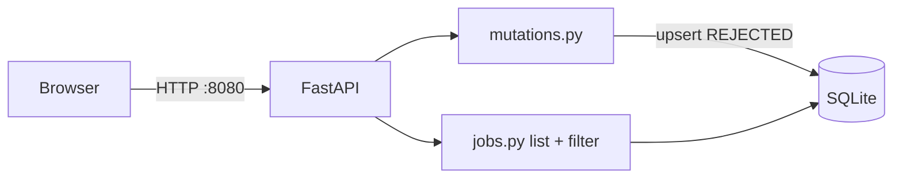
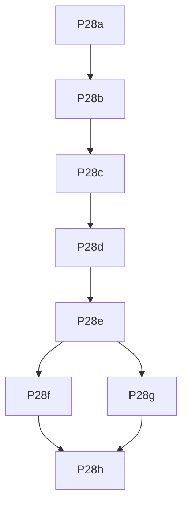

## Mission

Give Docker operators a **local web UI** on `data/agentzero.db` to **browse**, **change status**, **edit notes**, and **nop** roles you do not want—**without hard-deleting rows**. “Remove” means set `status=rejected` (same as MCP `reject_leads`: kept in SQLite for dedupe, excluded from sheet export). Default view **hides rejected** so the table stays focused; toggle to audit noped jobs. Google Sheets sync remains optional (`sync_sheets.py`). Promote leads via status `lead` → `new`.

**Done when:** `docker compose up web` supports list/filter + edit + reject with tests and **prep-pr** per task.

## Locked decisions

| Topic | Decision |
|-------|----------|
| Stack | **FastAPI** + **Jinja2** HTML forms (POST + redirect); **uvicorn** |
| Scope v1 | **Read + write:** list (filtered), POST status, POST notes, **POST reject (soft-delete)** |
| No hard delete | Web layer **never** calls `Database.delete_jobs`; purge stays CLI-only (`purge_*`, `prune_*`) |
| Soft-delete / nop | `reject_job` → `ApplicationStatus.REJECTED` via `upsert_job` (mirror `agentzero/leads/session.py` `reject_leads`) |
| Default list | **`include_rejected=false`** — hide `rejected` rows |
| Show noped | Query `?show_rejected=1` + checkbox on HTML index to include rejected |
| Status values | All `ApplicationStatus` via validated POST; dropdown can restore a rejected row to `new` / `lead` etc. |
| Promote lead | `lead` → `new` via status change (single-row approve) |
| Notes | `JobPosting.notes`; strip; max ~8k in API layer |
| Data | `list_jobs` + filter in `jobs.py`; mutations only `upsert_job` |
| Sheets | Rejected rows already excluded by `export_filter` — no sheet change needed |
| Auth | None v1 — local Docker; warn in `docs/SECURITY.md` |
| Port | **8080** |
| Branch prefix | `feat/web-` |
| PR policy | **prep-pr** per task |

## Architecture



| Module | Role |
|--------|------|
| `agentzero/web/jobs.py` | `list_jobs_for_ui(db, *, include_rejected=False, status_filter=None)` |
| `agentzero/web/mutations.py` | `update_job_status`, `update_job_notes`, `reject_job` |
| `agentzero/web/app.py` | Routes + templates |
| `agentzero/leads/session.py` | Reference behavior for reject (LEAD → REJECTED) |

**API surface (v1)**

| Method | Path | Purpose |
|--------|------|---------|
| GET | `/health` | Liveness |
| GET | `/` | HTML table; `?show_rejected=1` includes noped rows |
| GET | `/api/jobs` | JSON list; `?include_rejected=true` |
| POST | `/api/jobs/{job_id}/status` | `{ "status": "..." }` |
| POST | `/api/jobs/{job_id}/notes` | `{ "notes": "..." }` |
| POST | `/api/jobs/{job_id}/reject` | Soft-delete → `rejected` (idempotent) |
| POST | `/jobs/{job_id}/reject` | HTML form “Nope” → redirect preserving filter query |

Per row: status `<select>`, notes `<input>`, **Nope** button (reject), no Delete.

## Build-loop contract

Re-read this plan + [`PROGRESS.md`](../PROGRESS.md) → task branch → TDD → Accept → **prep-pr** → check box → [`WORKLOG.md`](../WORKLOG.md).

## Git + PR workflow

One branch per task; **prep-pr** before done; never implement on `main`.

## Parallel execution



| Wave | Tasks |
|------|--------|
| 1 | P28a |
| 2 | P28b |
| 3 | P28c |
| 4 | P28d |
| 5 | P28e |
| 6 | P28f, P28g |
| 7 | P28h |

## Test / quality standard

- `ruff check agentzero tests scripts tools`
- `pytest -q` (+ per-task `--cov`)
- `TestClient` + temp `Database`
- P28h: `docker build -t agentzero:web-smoke .`

## Task ledger

### P28a — Web config + optional extra

- **Branch:** `feat/web-P28a-config`
- **Files:** `agentzero/config.py`, `tests/test_config.py`, `pyproject.toml`
- **Test-first:** `test_web_settings_defaults`, `test_web_port_valid`
- **Accept:** `pytest tests/test_config.py -q && ruff check agentzero/config.py tests/test_config.py` → green; `[web]` extra with fastapi, uvicorn, jinja2
- **Ship:** prep-pr → PR URL

### P28b — Job list presenter + reject filter

- **Branch:** `feat/web-P28b-jobs-view`
- **Files:** `agentzero/web/jobs.py`, `agentzero/web/__init__.py`, `tests/test_web_jobs.py`
- **Test-first:** `test_list_excludes_rejected_by_default`, `test_list_include_rejected`, `test_list_includes_leads`, `test_row_shape`
- **Accept:** `pytest tests/test_web_jobs.py --cov=agentzero.web.jobs --cov-fail-under=100 -q` → green
- **Ship:** prep-pr → PR URL

### P28c — Read-only app + HTML table + filter toggle

- **Branch:** `feat/web-P28c-read-routes`
- **Files:** `agentzero/web/app.py`, `agentzero/web/templates/jobs.html`, `tests/test_web_app_read.py`
- **Test-first:** `test_health`, `test_index_hides_rejected_by_default`, `test_show_rejected_query`, `test_api_jobs_include_rejected_param`
- **Accept:** `pytest tests/test_web_app_read.py --cov=agentzero.web.app --cov-fail-under=85 -q && ruff check agentzero/web tests/test_web_app_read.py` → green
- **Ship:** prep-pr → PR URL

### P28d — Mutation service layer (no delete)

- **Branch:** `feat/web-P28d-mutations`
- **Files:** `agentzero/web/mutations.py`, `tests/test_web_mutations.py`
- **Test-first:** `test_update_status_persists`, `test_update_notes_strips`, `test_reject_sets_rejected`, `test_reject_idempotent`, `test_reject_unknown_404`, `test_cannot_delete_via_mutations` (no `delete_jobs` import/use)
- **Accept:** `pytest tests/test_web_mutations.py --cov=agentzero.web.mutations --cov-fail-under=100 -q` → green
- **Ship:** prep-pr → PR URL  
- **Notes:** `reject_job` uses `job.model_copy(update={"status": ApplicationStatus.REJECTED})`; status POST may set `date_applied` when moving to `applied` (align `sheet_fields` behavior).

### P28e — Write routes + Nope button

- **Branch:** `feat/web-P28e-write-routes`
- **Files:** `agentzero/web/app.py`, `agentzero/web/templates/jobs.html`, `tests/test_web_app_write.py`
- **Test-first:** `test_post_status`, `test_post_notes`, `test_post_reject_hides_from_default_index`, `test_reject_then_show_rejected_lists_row`
- **Accept:** `pytest tests/test_web_app_read.py tests/test_web_app_write.py --cov=agentzero.web --cov-fail-under=90 -q && ruff check agentzero/web tests/test_web_app_write.py` → green
- **Ship:** prep-pr → PR URL

### P28f — Docker Compose `web` service

- **Branch:** `feat/web-P28f-compose-web`
- **Files:** `docker-compose.yml`, `tests/test_docker_compose_web.py`
- **Test-first:** `test_web_service_exists`, `test_port_8080`, `test_data_volume`
- **Accept:** `pytest tests/test_docker_compose_web.py -q` → green
- **Ship:** prep-pr → PR URL

### P28g — Docs + security note

- **Branch:** `feat/web-P28g-docs`
- **Files:** `docs/DOCKER.md`, `docs/SECURITY.md`, `README.md`, `.env.example`, `tests/test_docs_web.py`
- **Test-first:** `test_docker_doc_mentions_reject_filter`, `test_security_warns_no_auth`
- **Accept:** `pytest tests/test_docs_web.py -q && ruff check .` → green
- **Ship:** prep-pr → PR URL

### P28h — P28 acceptance gate

- **Branch:** `feat/web-P28h-done`
- **Files:** `PROGRESS.md`, `WORKLOG.md` (append)
- **Accept:** `pytest -q && ruff check agentzero tests scripts tools && docker build -t agentzero:web-smoke .` → green; manual: Nope → row disappears from default view; show rejected → visible; change status/notes; `sync_sheets.py --dry-run` unchanged
- **Ship:** prep-pr → PR URL

## PROGRESS.md bootstrap

```markdown
## P28 — Docker web job tracker (list + edit + soft-reject)

- [ ] P28a Web config + optional extra
- [ ] P28b Job list presenter + reject filter
- [ ] P28c Read-only app + filter toggle
- [ ] P28d Mutation service (status, notes, reject — no hard delete)
- [ ] P28e Write routes + Nope button
- [ ] P28f Docker Compose web service
- [ ] P28g Docs + security note
- [ ] P28h P28 acceptance gate
- [ ] P28 done — web UI; rejected hidden by default; Sheets optional
```

## Operator flows (document in P28g)

1. **Nope / reject** — sets `rejected`; row leaves default list; still in DB for dedupe (same as MCP `reject_leads`).
2. **Show rejected** — checkbox / query param to review noped roles.
3. **Change status** — e.g. restore `rejected` → `new`, or `lead` → `new`; optional `sync_sheets.py --yes`.
4. **Notes** — save per row.
5. **Hard delete** — not in UI; use existing purge/prune CLIs if ever needed.

## Out of scope (P29+)

- Hard delete in web UI
- OAuth
- Bulk reject all leads
- Removing Google Sheets
- WebSocket scrape progress
- SPA framework

## Related skills

| Phase | Skill |
|-------|--------|
| Plan | ralph-this-plz |
| Build | Agent + TDD |
| Ship task | prep-pr |
| Post-merge | babysit |
