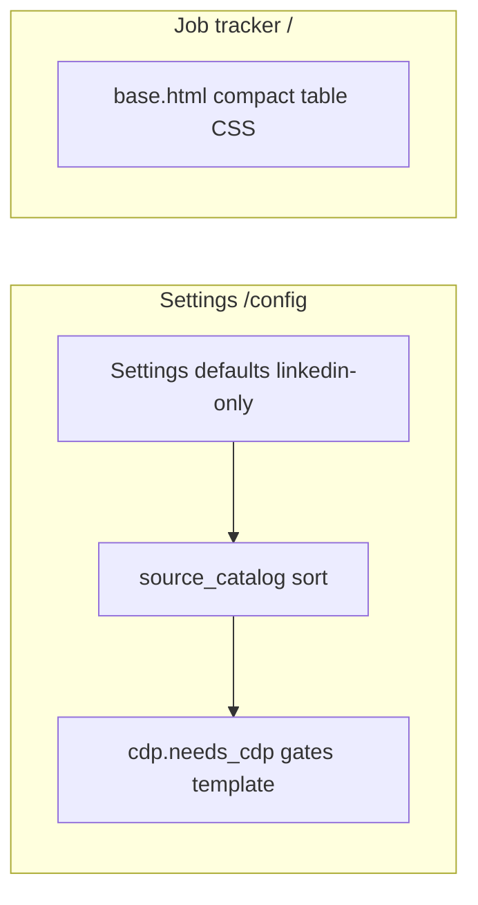
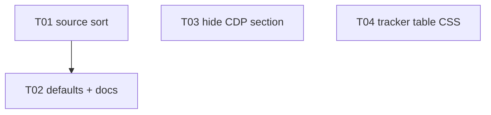

## Mission

Improve the operator web UI on port 8080:

1. **Job tracker** — table visually centered on the page, tighter vertical spacing (responsive horizontal scroll when wide).
2. **Settings → Scrape sources** — Indeed/Glassdoor (CDP boards) listed **after** LinkedIn and JobSpy sources.
3. **Defaults** — new installs / env defaults enable **LinkedIn + JobSpy only**; Indeed and Glassdoor **off** until the operator opts in.
4. **Chrome CDP card** — entire section **hidden** unless at least one **enabled** source uses CDP.

Done when each task passes Accept + **prep-pr** per task branch.

## Locked decisions

| Decision | Choice |
|----------|--------|
| CDP boards | `indeed`, `glassdoor` when `use_cdp_for_site()` is true |
| Default `scrape_browser_sites` | `["linkedin"]` (JobSpy defaults unchanged) |
| Existing `web_operator_config.json` | Not migrated; only affects fresh Settings / empty operator overlay |
| Table “dynamic” | CSS-only: centered wrapper, `max-content` width, `overflow-x: auto`; no new JS |
| CDP section | Omit full `<section>` from HTML when `needs_cdp` is false (not “Not needed” placeholder) |
| Branch prefix | `feat/web-P34-` |
| PR policy | One PR per task via **prep-pr** |

## Architecture



## Build-loop contract

Per [build-loop-contract](.cursor/skills/ralph-this-plz/references/build-loop-contract.md): re-read this plan + `PROGRESS.md`; one branch per task; TDD; **prep-pr** before checking the box.

## Git + PR workflow

1. Branch `feat/web-P34-T0x-…` from `main`
2. Failing tests → implement → Accept green
3. **prep-pr** on branch → record PR URL in `WORKLOG.md` DONE line

## Test / quality standard

```bash
ruff check agentzero tests scripts tools
pytest --cov=agentzero --cov-branch --cov-report=term-missing:skip-covered -q
python tools/encoding_check.py
```

## Parallel execution

| Wave | Tasks |
|------|-------|
| 1 | T01, T03 (no file overlap) |
| 2 | T02 (depends T01 for catalog test expectations) |
| 3 | T04 (independent CSS) |



## Task ledger

- **T01 — Sort scrape sources (CDP boards last)**. Branch: `feat/web-P34-T01-source-sort`.
  Files: `agentzero/web/sources.py`, `tests/test_web_sources.py`.
  Test-first: `test_source_catalog_orders_cdp_sites_last` (linkedin/google before indeed/glassdoor).
  Accept: `pytest tests/test_web_sources.py -q` → 0 failures; `ruff check agentzero/web/sources.py` → clean.
  Ship: prep-pr → PR URL.

- **T02 — Default browser sites without CDP boards**. Branch: `feat/web-P34-T02-cdp-off-defaults`.
  Files: `agentzero/config.py`, `.env.example`, `docs/GETTING_STARTED.md`, `tests/test_config.py`, `tests/test_web_sources.py`.
  Test-first: `test_default_scrape_browser_sites_linkedin_only`; update `test_source_catalog_all_enabled_by_default` → only linkedin + jobspy enabled.
  Accept: `pytest tests/test_config.py tests/test_web_sources.py -q` → 0 failures.
  Ship: prep-pr → PR URL.

- **T03 — Hide Chrome CDP section when unused**. Branch: `feat/web-P34-T03-hide-cdp-card`.
  Files: `agentzero/web/templates/config.html`, `tests/test_web_app_config.py`.
  Test-first: `test_config_page_omits_chrome_cdp_when_no_cdp_sources` (linkedin-only operator → no “Chrome CDP” heading).
  Accept: `pytest tests/test_web_app_config.py -q` → 0 failures.
  Ship: prep-pr → PR URL.

- **T04 — Centered compact job tracker table**. Branch: `feat/web-P34-T04-tracker-table-ux`.
  Files: `agentzero/web/templates/base.html`, `agentzero/web/templates/jobs.html`, `tests/test_web_app_read.py`.
  Test-first: `test_jobs_page_has_centered_table_wrapper` and `test_jobs_table_compact_styles_present`.
  Accept: `pytest tests/test_web_app_read.py tests/test_web_jobs.py -q` → 0 failures.
  Ship: prep-pr → PR URL.

- **T05 — Ledger gate**. Branch: `feat/web-P34-T05-ledger` (or fold into T04 PR if trivial).
  Files: `PROGRESS.md`, `WORKLOG.md` (append-only P34 DONE).
  Test-first: `pytest tests/test_worklog_append_only.py -q`.
  Accept: P34a–d checked in `PROGRESS.md`; worklog append-only test green.
  Ship: prep-pr if separate; else skip if merged with T04.

## Implementation notes

### T01 — Source order

In `source_catalog`, iterate browser sites in two passes:

1. `CORE_BROWSER_SITES` where `not settings.use_cdp_for_site(site)`
2. JobSpy sites (unchanged order)
3. `CORE_BROWSER_SITES` where `settings.use_cdp_for_site(site)`

Display order example: LinkedIn → Google Jobs → ZipRecruiter → Indeed → Glassdoor.

### T02 — Defaults

```python
scrape_browser_sites: ... = Field(default_factory=lambda: ["linkedin"])
```

Document in `.env.example` that Indeed/Glassdoor need explicit enable + CDP setup. CLI/MCP unchanged except new-env behavior.

### T03 — CDP visibility

Wrap the entire Chrome CDP `<section class="card">` in ` … `. Remove the inner “Not needed” branch (dead when section hidden).

### T04 — Table CSS (sketch)

```css
.tracker-table-wrap {
  display: flex;
  justify-content: center;
  width: 100%;
  overflow-x: auto;
}
table.data-table {
  width: max-content;
  max-width: min(100%, 96vw);
  margin: 0 auto;
  font-size: 0.8125rem;
}
table.data-table th,
table.data-table td {
  padding: 0.28rem 0.45rem;
  line-height: 1.3;
}
```

Wrap `<table>` in `jobs.html` with `<div class="tracker-table-wrap">`.

## Out of scope

- Collapsible columns, column picker, or DataTables-style JS
- Changing scrape factory site order for CLI (only Settings catalog order)
- Auto-disabling CDP in `.env` for existing operators with saved config

## PROGRESS.md bootstrap

```markdown
## P34 — Web UI/UX spike (2026-06-02)

- [ ] P34a Source catalog: CDP boards listed last
- [ ] P34b Defaults: LinkedIn-only browser boards (CDP off)
- [ ] P34c Hide Chrome CDP card when no CDP source enabled
- [ ] P34d Job tracker: centered, compact table
```
